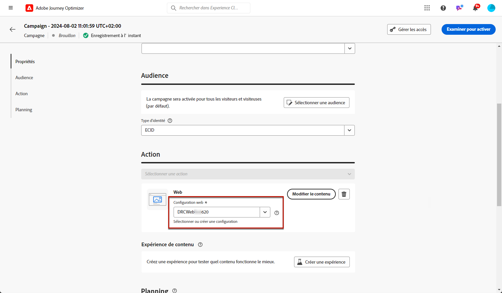
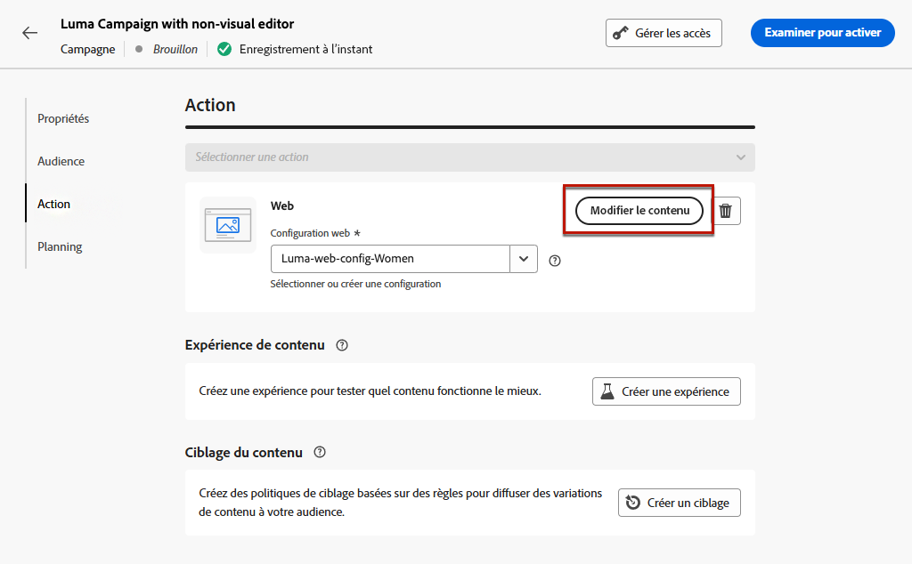

# Créer des expériences web {#create-web}

[!DNL Journey Optimizer] vous permet de personnaliser l’expérience web que vous diffusez à vos clientes et clients par le biais de campagnes ou parcours entrants.

## Définition d’une expérience web par le biais d’un parcours ou d’une campagne {#create-web-experience}

>[!CONTEXTUALHELP]
>id="ajo_web_surface"
>title="Définir une configuration web"
>abstract="Une configuration web peut correspondre à l’URL d’une ou de plusieurs pages, ce qui vous permet de diffuser des modifications de contenu sur une ou plusieurs pages web."

>[!CONTEXTUALHELP]
>id="ajo_web_surface_rule"
>title="Création d’une règle de correspondance de pages"
>abstract="Une règle de correspondance de pages permet de cibler plusieurs URL qui correspondent à la même règle, notamment si vous souhaitez appliquer les modifications à une bannière principale sur l’ensemble d’un site web ou ajouter une image principale qui s’affiche sur toutes les pages produits d’un site web."

Pour commencer à créer votre expérience web par le biais d’une campagne ou d’un parcours, suivez les étapes ci-dessous.

>[!NOTE]
>
>Si c’est la première fois que vous créez une expérience web, veillez à respecter les conditions préalables décrites dans [cette section](web-prerequisites.md).

>[!BEGINTABS]

>[!TAB Ajouter une expérience web à un parcours]

Pour ajouter une activité **Web** pour un parcours, procédez comme suit :

1. [Créez un parcours](../building-journeys/journey-gs.md).

1. Débutez votre parcours avec une activité [Événement](../building-journeys/general-events.md) ou [Lecture d’audience](../building-journeys/read-audience.md).

1. Faites glisser et déposez une activité **[!UICONTROL Web]** depuis la section **[!UICONTROL Actions]** de la palette.

   

   >[!NOTE]
   >
   >**Web** est une activité d’expérience entrante. Dès lors, elle s’accompagne d’une activité **Attente** de 3 jours. [En savoir plus](../building-journeys/wait-activity.md#auto-wait-node)

1. Saisissez un **[!UICONTROL libellé]** et une **[!UICONTROL description]** pour votre message.

1. Sélectionnez ou créez la [configuration web](web-configuration.md) à utiliser.

   

1. Sélectionnez le bouton **[!UICONTROL Modifier le contenu]** et modifiez votre contenu selon vos besoins. [En savoir plus](#edit-web-content)

1. Si nécessaire, complétez votre flux de parcours en faisant glisser et en déposant des actions ou des événements supplémentaires. [En savoir plus](../building-journeys/about-journey-activities.md).

1. Une fois votre expérience web prête, finalisez la configuration et publiez votre parcours pour l’activer. [En savoir plus](../building-journeys/publish-journey.md)

Pour plus d’informations sur la configuration de votre parcours, consultez [cette page](../building-journeys/journey-gs.md).

>[!TAB Créer une campagne web]

Pour commencer à créer votre expérience web par le biais d’une campagne, suivez les étapes ci-dessous.

1. Création d’une campagne. [En savoir plus](../campaigns/create-campaign.md)

1. Sélectionner le type de campagne que vous souhaitez exécuter.

   * **Scheduled - Marketing** : permet d’exécuter la campagne immédiatement ou à une date spécifiée. Les campagnes planifiées visent à envoyer des messages marketing. Elles sont configurées et exécutées à partir de l’interface d’utilisation.

   * **Déclenchée par API - Marketing/Transactionnelle** : permet d’exécuter la campagne à l’aide d’un appel API. Les campagnes déclenchées par API sont destinées à envoyer des messages marketing, ou transactionnels, c’est-à-dire des messages envoyés suite à une action effectuée par une personne : réinitialisation du mot de passe, achat du panier, etc. [Découvrir comment déclencher une campagne à l’aide d’API](../campaigns/api-triggered-campaigns.md)

1. Suivez les étapes de création d’une campagne web, telles que les propriétés de la campagne, l’[audience](../audience/about-audiences.md) et le [planning](../campaigns/create-campaign.md#schedule).

1. Sélectionnez l’action **[!UICONTROL Web]**.

1. Sélectionnez ou créez la configuration web. [En savoir plus sur la configuration web](web-configuration.md)

   

1. Cliquez sur le bouton **[!UICONTROL Modifier le contenu]** pour modifier votre contenu selon vos besoins. [En savoir plus](#edit-web-content)

   <!---->

Pour plus d’informations sur la configuration d’une campagne, consultez cette [page](../campaigns/get-started-with-campaigns.md).

➡️ [Découvrez comment créer une campagne web dans cette vidéo.](#video)

>[!ENDTABS]

## Modifier un contenu web {#edit-web-content}

>[!CONTEXTUALHELP]
>id="ajo_web_url_to_edit_surface"
>title="Confirmer l’URL à modifier"
>abstract="Confirmez l’URL de la page web spécifique à utiliser pour modifier le contenu qui sera appliquée sur la configuration web définie ci-dessus. La page web doit être implémentée à l’aide du SDK Web Adobe Experience Platform."
>additional-url="https://experienceleague.adobe.com/docs/platform-learn/implement-web-sdk/overview.html?lang=fr" text="En savoir plus"

>[!CONTEXTUALHELP]
>id="ajo_web_url_to_edit_rule"
>title="Saisissez l’URL à modifier."
>abstract="Saisissez l’URL d’une page web spécifique à utiliser pour la modification du contenu qui sera appliqué à toutes les pages correspondant à la règle. La page web doit être mise en œuvre à l’aide du SDK web Adobe Experience Platform."
>additional-url="https://experienceleague.adobe.com/docs/platform-learn/implement-web-sdk/overview.html?lang=fr" text="En savoir plus"

Après l’[ajout d’une action web](#create-web-experience) dans un parcours ou une campagne, vous pouvez modifier le contenu de votre site à l’aide de l’un des outils suivants :

* le [concepteur web](web-visual-editor.md), pour créer votre expérience à l’aide d’un éditeur visuel ;
* ou l’[éditeur non visuel](web-non-visual-editor.md).

Pour commencer à créer votre expérience web, procédez comme suit.

1. Dans l’onglet **[!UICONTROL Action]** de la campagne ou de l’activité **[!UICONTROL Web]** dans le parcours, sélectionnez **[!UICONTROL Modifier le contenu]**.

   

1. L’écran de modification s’affiche. Vous pouvez effectuer l’une des actions suivantes :

   * Cliquez sur le bouton **[!UICONTROL Modifier la page web]** pour commencer à créer votre contenu à l’aide du concepteur web pour une expérience visuelle. [En savoir plus](web-visual-editor.md)

     

   * Désélectionnez l’option **[!UICONTROL Éditeur visuel]** pour utiliser le mode de modification non visuel, puis cliquez sur **[!UICONTROL Ajouter une modification]** pour commencer à modifier votre contenu web sans charger l’éditeur visuel. [En savoir plus](web-non-visual-editor.md)

     

## Tester l’expérience web {#test-web-experience}

>[!CONTEXTUALHELP]
>id="ajo_web_designer_preview"
>title="Prévisualiser votre expérience web."
>abstract="Effectuez une simulation de ce à quoi ressemblera votre expérience web."

Une fois que vous avez [créé votre expérience web](web-visual-editor.md) grâce au concepteur web, vous pouvez afficher un aperçu de vos pages web modifiées. Si vous avez inséré du contenu personnalisé, vous pouvez vérifier l’affichage de ce contenu à l’aide des données de profil de test.

Pour ce faire, cliquez sur **[!UICONTROL Simuler du contenu]** depuis l’écran de modification de contenu de la campagne ou du parcours, puis ajoutez un profil de test pour vérifier votre page web à l’aide des données du profil de test.

Vous pouvez également l’ouvrir dans le navigateur par défaut ou copier l’URL de test pour la coller dans n’importe quel navigateur. Vous pouvez ainsi partager le lien avec votre équipe et les parties prenantes qui pourront prévisualiser la nouvelle expérience web dans n’importe quel navigateur avant que la campagne ne soit activée.

>[!NOTE]
>
>Lors de la copie de l’URL de test, le contenu affiché est celui personnalisé pour le profil de test utilisé lors de la génération de la simulation de contenu dans [!DNL Journey Optimizer].

Vous trouverez des informations détaillées sur la sélection des profils de test et la prévisualisation de votre contenu dans la section [Gestion de contenu](../content-management/preview-test.md).

## Rediriger vers l’URL {#web-redirect-to-url}

>[!CONTEXTUALHELP]
>id="ajo_web_designer_redirect"
>title="Rediriger vers une autre URL"
>abstract="Saisissez une URL existante vers laquelle vous souhaitez rediriger les visiteurs et visiteuses de votre page."

Lors de la création d’une expérience web, vous pouvez rediriger les visiteurs et visiteuses vers une autre URL existante plutôt que de créer une nouvelle variation dans le concepteur web.

Cette capacité vous permet ainsi d’exécuter une [expérience de contenu](../content-management/content-experiment.md)afin de comparer deux expériences différentes au lieu de simplement modifier quelques éléments dans une page.

Par exemple, créez une campagne web avec deux traitements :

* Dans **Traitement A**, créez une expérience web à l’aide du concepteur web destinée à la moitié de votre population ciblée.

* Dans **Traitement B**, sélectionnez l’option **[!UICONTROL Rediriger vers l’URL]** pour l’autre moitié de la population ciblée. Saisissez l’URL d’une page dotée d’une autre conception que vous avez créée en dehors de [!DNL Journey Optimizer].

  

  >[!NOTE]
  >
  >L’aperçu du site web ne s’affiche plus et le bouton (bascule) **[!UICONTROL Éditeur visuel]** est désactivé.

Une fois votre campagne web active, vous pouvez suivre les performances de l’expérience web que vous avez créée dans [!DNL Journey Optimizer] pour les visiteurs et visiteuses de votre page par rapport à ceux qui ont été redirigés vers la page de destination externe. Découvrez comment utiliser le [rapport de campagne sur les expérimentations](../reports/campaign-global-report-cja-experimentation.md).

## Mettre en ligne votre expérience web {#web-experience-live}

>[!IMPORTANT]
>
> Si votre campagne est soumise à une politique d’approbation, vous devrez effectuer une demande d’approbation afin de pouvoir activer vos expériences web. [En savoir plus](../test-approve/gs-approval.md)

Une fois que vous avez défini votre expérience web et modifié votre contenu comme vous le souhaitez, vous pouvez activer votre parcours ou votre campagne pour rendre vos modifications visibles pour votre audience.

Vous pouvez également prévisualiser le contenu de votre expérience web avant de la mettre en ligne. [En savoir plus](#test-web-experience)

>[!NOTE]
>
>Si vous activez une campagne ou un parcours web ayant un impact sur les mêmes pages qu’une autre campagne ou qu’un autre parcours déjà en ligne, toutes les modifications seront appliquées à vos pages web.
>
>Si plusieurs parcours ou campagnes mettent à jour le ou les mêmes éléments de votre site web, le parcours ou la campagne avec la priorité la plus élevée prévaut.

### Publier un parcours web {#activate-web-journey}

Pour mettre en ligne votre expérience web à partir d’un parcours, procédez comme suit.

1. Vérifiez que votre parcours est valide et qu’il n’y a aucune erreur. [En savoir plus](../building-journeys/troubleshooting.md#activity-errors)

1. Depuis le parcours, sélectionnez l’option **[!UICONTROL Publier]** située dans le menu déroulant qui se trouve en haut à droite.

   

   >[!NOTE]
   >
   >Découvrez la publication des parcours dans [cette section](../building-journeys/publish-journey.md).

Le statut de votre parcours web est alors **[!UICONTROL Actif]** et il est désormais en lecture seule. Chaque destinataire de votre parcours peut voir les modifications que vous avez ajoutées à votre site web.

>[!NOTE]
>
>Après avoir cliqué sur **[!UICONTROL Activer]**, les modifications des campagnes web peuvent prendre jusqu’à 15 minutes avant d’être mises en ligne sur votre site web.

### Activer une campagne web {#activate-web-campaign}

Une fois que vous avez défini vos paramètres de campagne web et que vous avez modifié votre contenu selon vos besoins, vous pouvez examiner et activer votre campagne web. Suivez les étapes ci-dessous.

1. Dans votre campagne web, sélectionnez **[!UICONTROL Examiner pour activer]**.

1. Vérifiez et modifiez si nécessaire le contenu, les propriétés, la configuration, l’audience et le planning.

1. Sélectionnez **[!UICONTROL Activer]**.

   

   >[!NOTE]
   >
   >En savoir plus sur l’activation des campagnes dans [cette section](../campaigns/review-activate-campaign.md).

Votre campagne web passe au statut **[!UICONTROL Actif]** et est maintenant visible pour l’audience sélectionnée. Chaque destinataire de votre campagne peut voir les modifications que vous avez ajoutées à votre site web.

>[!NOTE]
>
>Après avoir cliqué sur **[!UICONTROL Activer]**, les modifications des campagnes web peuvent prendre jusqu’à 15 minutes pour être disponibles en direct sur votre site web.
>
>Si vous avez défini un planning pour votre campagne web, celle-ci conserve le statut **[!UICONTROL Planifié]** jusqu’à ce que la date et l’heure de début soient atteintes.

Une fois votre expérience mise en ligne, vous pouvez surveiller vos parcours web et vos campagnes web. [En savoir plus](monitor-web-experiences.md)

## Arrêter un parcours ou une campagne web {#stop-web-experience}

Lorsqu’une campagne ou est parcours web est en ligne, vous pouvez l’arrêter afin d’empêcher votre audience de voir vos modifications. Suivez les étapes ci-dessous.

1. Sélectionnez une campagne active ou un parcours actif dans la liste correspondante.

1. Effectuez l’action appropriée en fonction de votre cas :

   * Dans le menu supérieur de la campagne, sélectionnez **[!UICONTROL Arrêter la campagne]**.

     

   * Dans le menu supérieur du parcours, cliquez sur le bouton **[!UICONTROL Plus]** et sélectionnez **[!UICONTROL Arrêter]**.

     

1. Les modifications que vous avez ajoutées ne sont plus visibles pour l’audience que vous avez définie.

>[!NOTE]
>
>Après l’arrêt d’une campagne ou d’un parcours web, vous ne pouvez plus y apporter de modifications ni l’activer. Vous pouvez uniquement dupliquer la campagne ou le parcours et activer l’élément dupliqué.

## Vidéo pratique{#video}

La vidéo ci-dessous montre comment créer une campagne web, configurer ses propriétés, la réviser et la publier.

>[!VIDEO](https://video.tv.adobe.com/v/3449983/?captions=fre_fr&quality=12&learn=on)