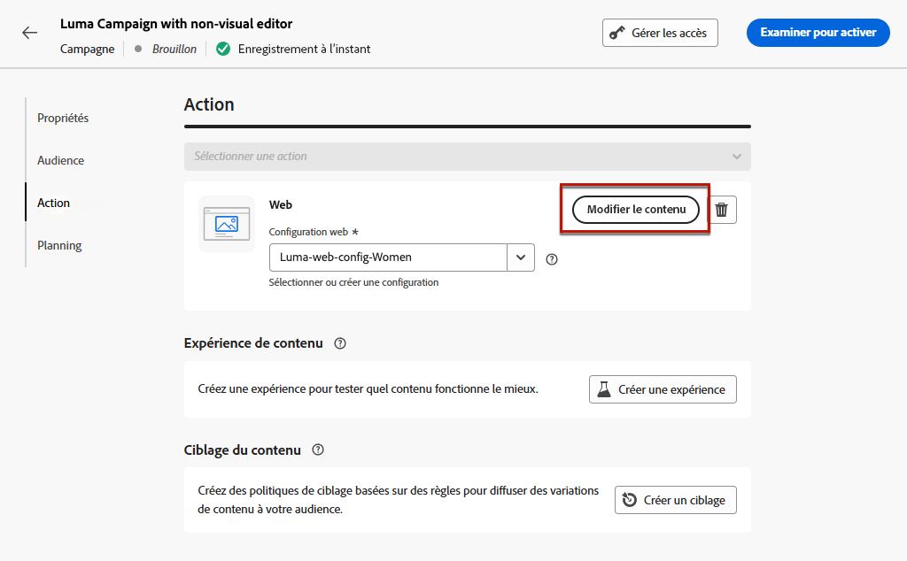
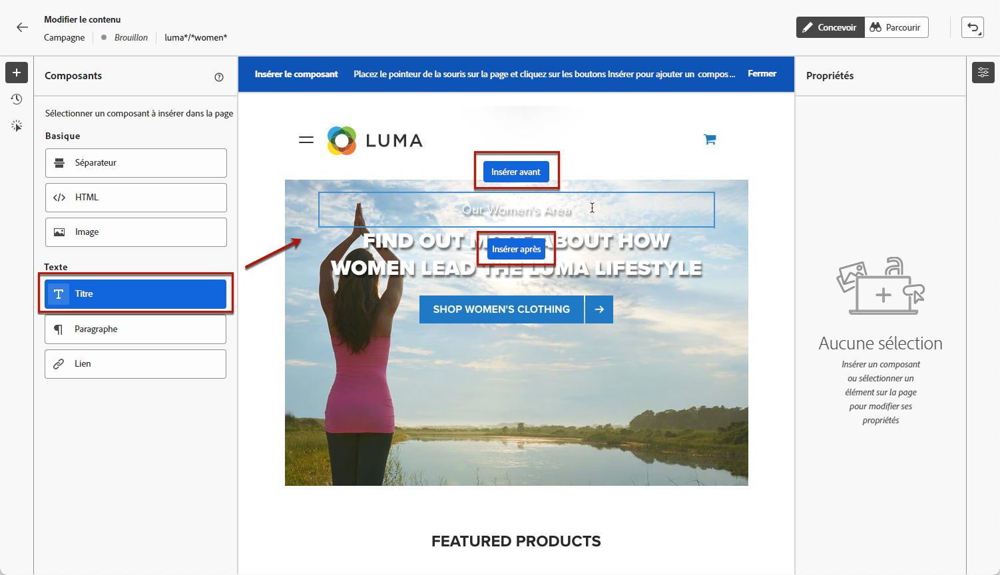
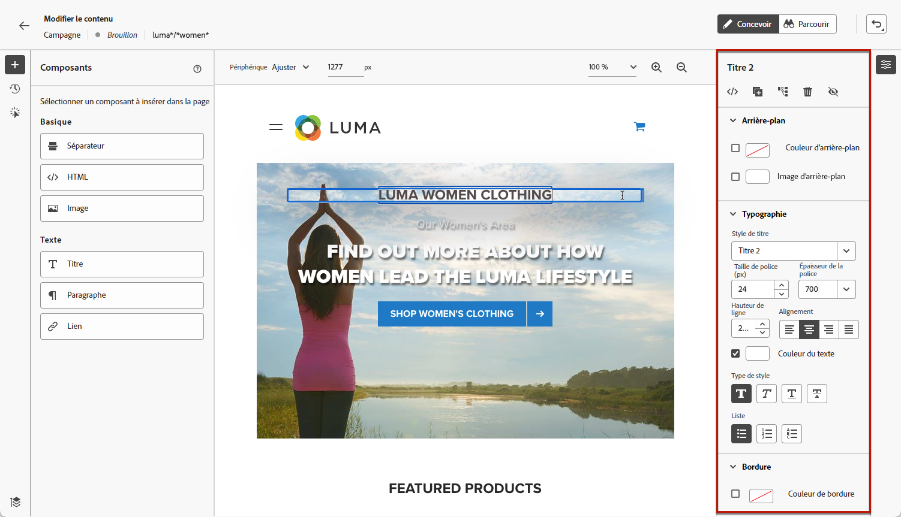
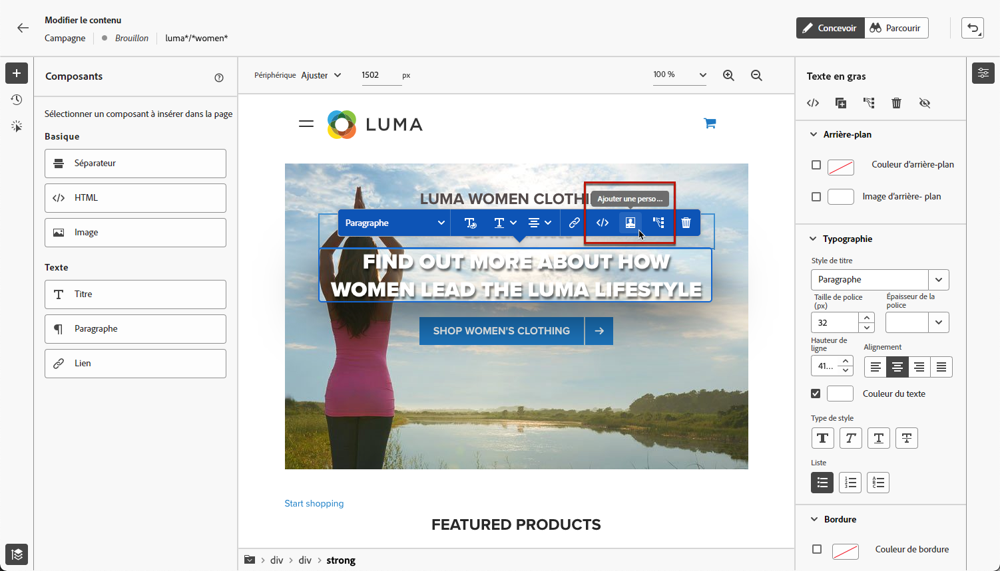
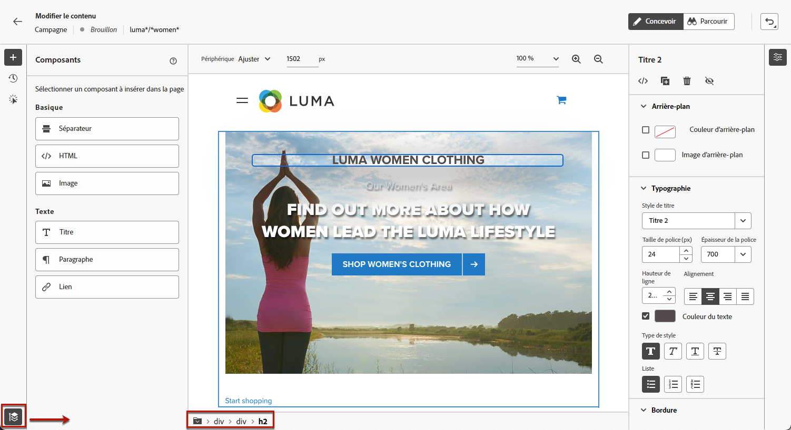

# Modifier un contenu web {#edit-web-content}

Après l’[ajout d’une expérience web](create-web.md#create-web-experience) dans un parcours ou une campagne, vous pouvez modifier le contenu de votre site à l’aide du concepteur web.

[Découvrez comment créer une campagne web dans cette vidéo.](#video)

Dans [!DNL Journey Optimizer], la création web est optimisée par l’extension de navigateur Chrome **Visual Helper d’Adobe Experience Cloud**. [En savoir plus](web-prerequisites.md#visual-authoring-prerequisites).

>[!CAUTION]
>
>Pour créer des pages web dans l’interface utilisateur de [!DNL Journey Optimizer] et y accéder, suivez les conditions préalables répertoriées dans [cette section](web-prerequisites.md).

Accédez aux sections suivantes pour en savoir plus sur chaque rubrique :

* [Gérer les modifications](manage-web-modifications.md)

* [Surveiller vos campagnes web](monitor-web-experiences.md)

## Utiliser le concepteur web {#work-with-web-designer}

>[!CONTEXTUALHELP]
>id="ajo_web_url_to_edit_surface"
>title="Confirmer l’URL à modifier"
>abstract="Confirmez l’URL de la page web spécifique à utiliser pour modifier le contenu qui sera appliquée sur la configuration web définie ci-dessus. La page web doit être implémentée à l’aide du SDK Web Adobe Experience Platform."
>additional-url="https://experienceleague.adobe.com/docs/platform-learn/implement-web-sdk/overview.html?lang=fr" text="En savoir plus"

>[!CONTEXTUALHELP]
>id="ajo_web_url_to_edit_rule"
>title="Saisissez l’URL à modifier."
>abstract="Saisissez l’URL d’une page web spécifique à utiliser pour la modification du contenu qui sera appliqué à toutes les pages correspondant à la règle. La page web doit être mise en œuvre à l’aide du SDK web Adobe Experience Platform."
>additional-url="https://experienceleague.adobe.com/docs/platform-learn/implement-web-sdk/overview.html?lang=fr" text="En savoir plus"

Pour commencer à créer votre expérience web, procédez comme suit :

1. Dans l’onglet **[!UICONTROL Action]** de la campagne ou de l’activité d’expérience web dans le parcours, sélectionnez **[!UICONTROL Modifier le contenu]**.<!--change screen with rule-->

   

1. Si vous avez créé une règle de correspondance de pages, vous devez saisir toute URL correspondant à cette règle : les modifications seront appliquées à toutes les pages correspondant à la règle. Le contenu de la page s’affiche.

   >[!NOTE]
   >
   >Si vous avez saisi une seule URL comme configuration web, l’URL à personnaliser est déjà renseignée.

   

   >[!CAUTION]
   >
   >La page web doit inclure le [SDK web d’Adobe Experience Platform](https://experienceleague.adobe.com/docs/platform-learn/implement-web-sdk/overview.html?lang=fr){target="_blank"}. [En savoir plus](web-prerequisites.md#implementation-prerequisites).

1. Cliquez sur **[!UICONTROL Modifier la page web]** pour commencer la création. Le concepteur web s’affiche.

   

   >[!NOTE]
   >
   >Si vous tentez de charger un site web et que le chargement échoue, un message s’affiche pour vous suggérer d’installer l’extension de navigateur [Visual Editing Helper](#install-visual-editing-helper). Consultez quelques conseils dans [cette section](web-prerequisites.md#troubleshooting) pour résoudre les problèmes.

1. Sélectionnez un élément dans la zone de travail, tel qu’une image, un bouton, un paragraphe, un texte, un conteneur, un en-tête, un lien, etc. [En savoir plus](#content-components).

1. Utilisation :

   * Le menu contextuel permettant de modifier son contenu, sa mise en page, d’insérer des liens ou la personnalisation, etc.

     

   * Les icônes situées en haut du panneau de droite permettent de modifier, dupliquer, supprimer ou masquer chaque élément.

     

   * Panneau de droite qui change dynamiquement en fonction de l’élément sélectionné. Vous pouvez, par exemple, modifier l’arrière-plan, la typographie, la bordure, la taille, la position, l’espacement, les effets ou les styles intégrés d’un élément.

     

>[!NOTE]
>
>Le concepteur de contenu web est très similaire au concepteur d’e-mail. En savoir plus sur la [conception de contenu avec  [!DNL Journey Optimizer]](../email/get-started-email-design.md).

## Utiliser les composants {#content-components}

>[!CONTEXTUALHELP]
>id="ajo_web_designer_components"
>title="Ajouter des composants à votre page web"
>abstract="Vous pouvez ajouter plusieurs composants à votre page web et les modifier selon vos besoins."

1. Dans le volet **[!UICONTROL Composants]** sur la gauche, sélectionnez un élément. Vous pouvez ajouter les composants suivants à votre page web et les modifier selon vos besoins :

   * [Diviseur](../email/content-components.md#divider)
   * [HTML](../email/content-components.md#HTML)
   * [Image](../email/content-components.md#image)
   * En-tête : l’utilisation de ce composant est similaire à l’utilisation du composant **[!UICONTROL Texte]** dans le concepteur d’e-mail. [En savoir plus](../email/content-components.md#text)
   * Paragraphe : l’utilisation de ce composant est similaire à l’utilisation du composant **[!UICONTROL Texte]** dans le concepteur d’e-mail. [En savoir plus](../email/content-components.md#text)
   * Lien

   

1. Passez la souris sur la page, puis cliquez sur le bouton **[!UICONTROL Insérer avant]** ou **[!UICONTROL Insérer après]** pour ajouter le composant à un élément existant sur la page.

   

   >[!NOTE]
   >
   >Pour désélectionner un composant, cliquez sur le bouton **[!UICONTROL Échap]** dans la bannière contextuelle bleue affichée au-dessus de la zone de travail.

1. Modifiez le composant suivant vos besoins directement dans le contenu de votre page.

   

1. Ajustez les styles qui s’affichent à partir du volet contextuel à droite, comme l’arrière-plan, la couleur du texte, la bordure, la taille, la position, etc. en fonction du composant sélectionné.

   

## Ajouter une personnalisation

Pour ajouter de la personnalisation, sélectionnez un conteneur et l’icône de personnalisation dans la barre du menu contextuel qui s’affiche. Apportez vos modifications à l’aide de l’éditeur de personnalisation. [En savoir plus](../personalization/personalization-build-expressions.md).

## Naviguer dans le concepteur web {#navigate-web-designer}

Cette section décrit les différentes manières de naviguer dans le concepteur web. Pour afficher et gérer les modifications ajoutées à votre expérience web, consultez [cette section](manage-web-modifications.md).

### Utiliser des chemins de navigation {#breadcrumbs}

1. Sélectionnez un élément dans la zone de travail.

1. Cliquez sur le bouton **[!UICONTROL Développer/réduire le chemin de navigation]** dans le coin inférieur gauche de l’écran pour afficher rapidement les informations sur l’élément sélectionné.

   

1. Lorsque vous pointez sur le chemin de navigation, l’élément correspondant est mis en surbrillance dans l’éditeur.

1. Grâce à cela, vous pouvez facilement accéder à n’importe quel élément parent, frère ou enfant dans l’éditeur visuel.

### Basculer vers le mode de navigation {#browse-mode}

>[!CONTEXTUALHELP]
>id="ajo_web_designer_browse"
>title="Utiliser le mode de navigation"
>abstract="Dans ce mode, vous pouvez accéder à la page exacte à partir de la configuration sélectionnée que vous voulez personnaliser."

Vous pouvez passer du mode **[!UICONTROL Conception]** par défaut au mode de **[!UICONTROL Navigation]** à l’aide du bouton dédié.

Dans le mode de **[!UICONTROL Navigation]**, vous pouvez accéder à la page exacte à partir de la configuration sélectionnée à personnaliser.

Il est particulièrement utile lorsque vous traitez des pages qui se trouvent derrière une authentification ou qui ne sont pas disponibles depuis le début à une certaine URL. Par exemple, vous serez en mesure de vous authentifier, d’accéder à la page de votre compte ou à la page de votre panier, puis de revenir au mode **[!UICONTROL Conception]** pour effectuer les modifications sur la page souhaitée.

L’utilisation du mode **[!UICONTROL Parcourir]** vous permet également de parcourir toutes les vues de votre site web lors de la création d’applications monopage. [En savoir plus](web-spa.md)

### Modifier la taille de l’appareil {#change-device-size}

Vous pouvez définir la taille de l’appareil d’affichage du concepteur web sur une taille prédéfinie, telle que **[!UICONTROL Tablette]** ou **[!UICONTROL Paysage mobile]**, ou encore définir une taille personnalisée en entrant le nombre de pixels souhaité.

Vous pouvez également modifier la mise au point du zoom, de 25 % à 400 %.

La possibilité de modifier la taille de l’appareil est conçue pour les sites réactifs qui s’affichent correctement sur divers appareils, fenêtres et tailles d’écran. Les sites réactifs s’ajustent et s’adaptent automatiquement à n’importe quelle taille d’écran, y compris les ordinateurs de bureau, les ordinateurs portables, les tablettes ou les téléphones portables.

>[!CAUTION]
>
>Vous pouvez modifier une expérience web avec une taille d’appareil spécifique. Toutefois, tant que les sélecteurs sont identiques, ces modifications s’appliquent à toutes les tailles et tous les appareils, et pas seulement à la taille de l’appareil dans lequel vous travaillez. De même, la modification d’une expérience dans l’affichage de bureau classique entraîne la modification de toutes les tailles d’écran et pas seulement pour l’affichage de bureau.
>
>Actuellement, [!DNL Journey Optimizer] ne prend pas en charge les modifications de page spécifiques à la fenêtre d’affichage. Cela signifie que si, par exemple, vous disposez d’un site web mobile distinct avec une structure de site distincte, vous devez apporter les modifications spécifiques à votre site mobile dans une autre campagne.

## Vidéo pratique{#video}

La vidéo ci-dessous montre comment créer une expérience web à l’aide du concepteur web dans les campagnes de [!DNL Journey Optimizer].

>[!VIDEO](https://video.tv.adobe.com/v/3418803/?quality=12&learn=on)