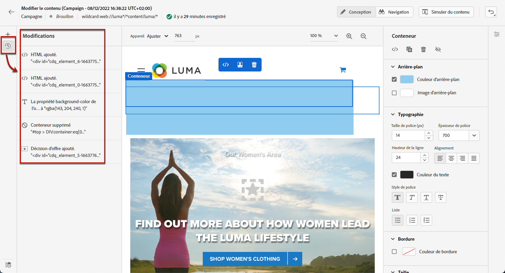
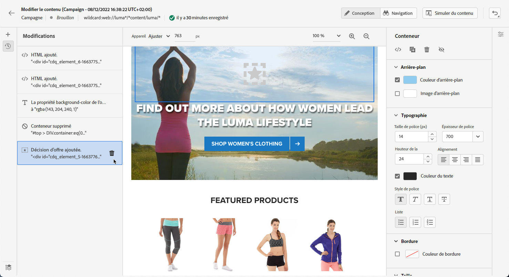
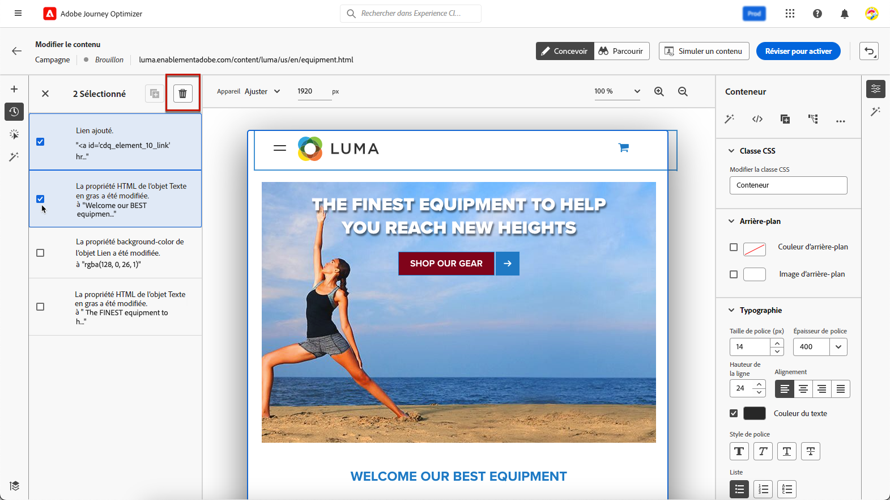
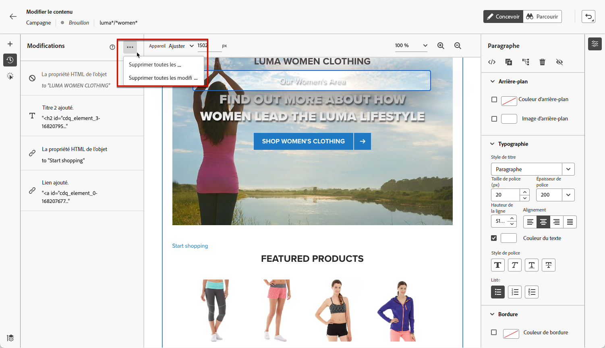
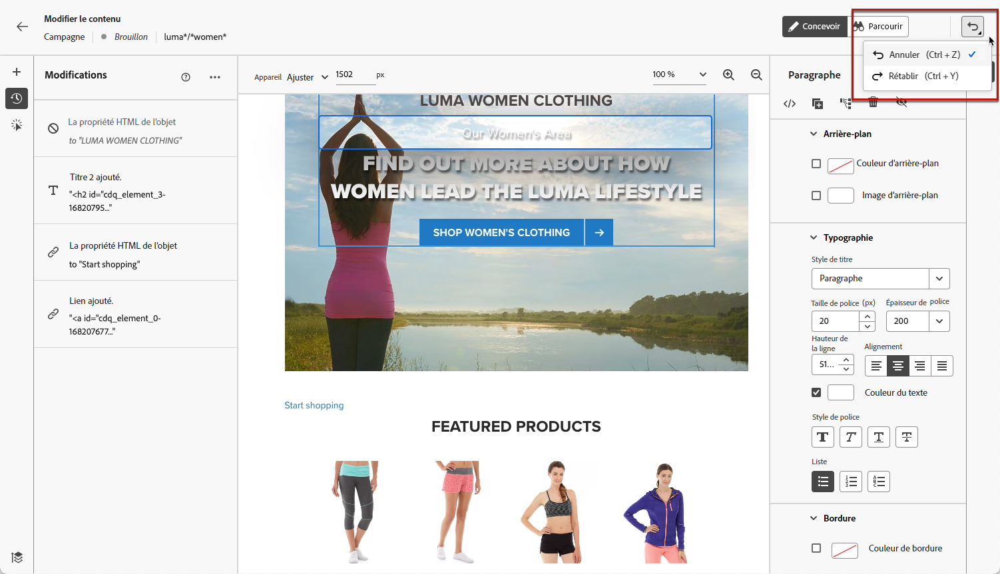
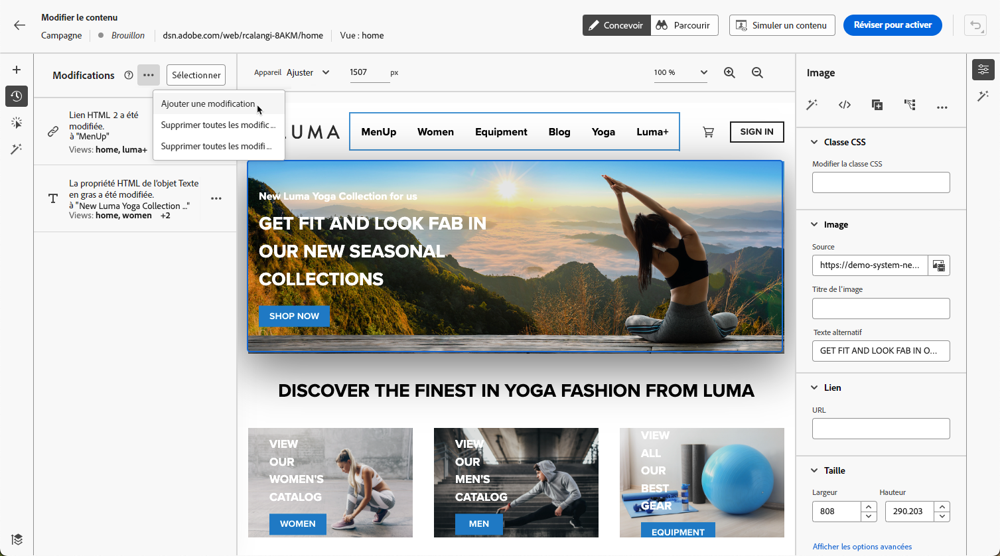
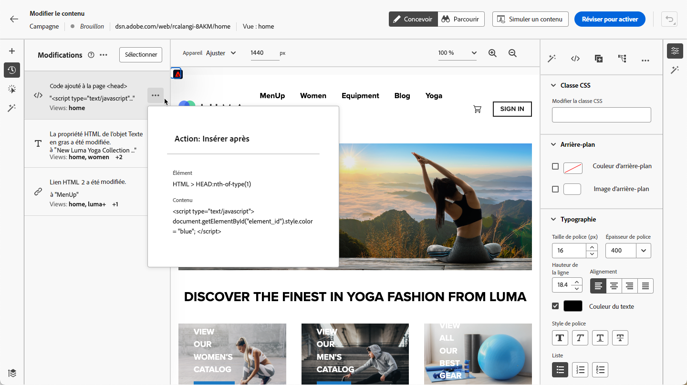
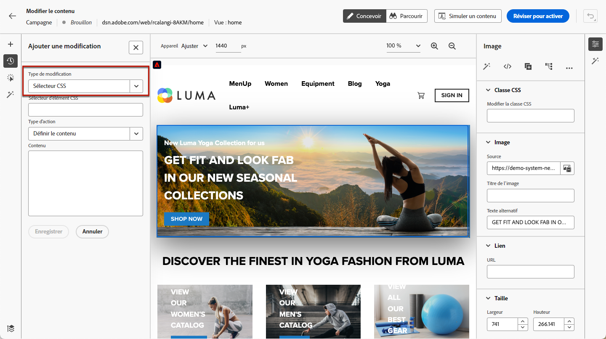
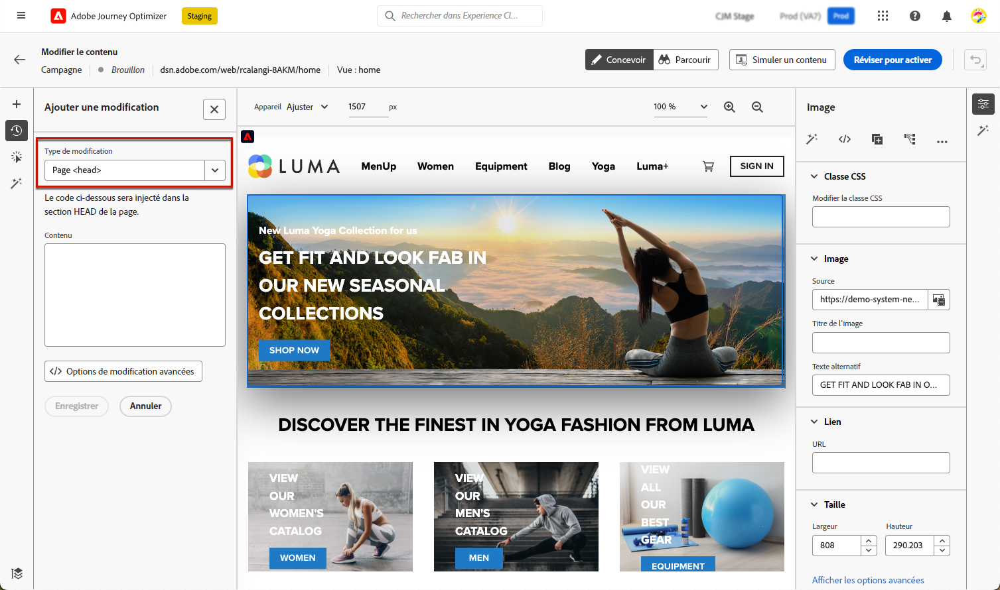
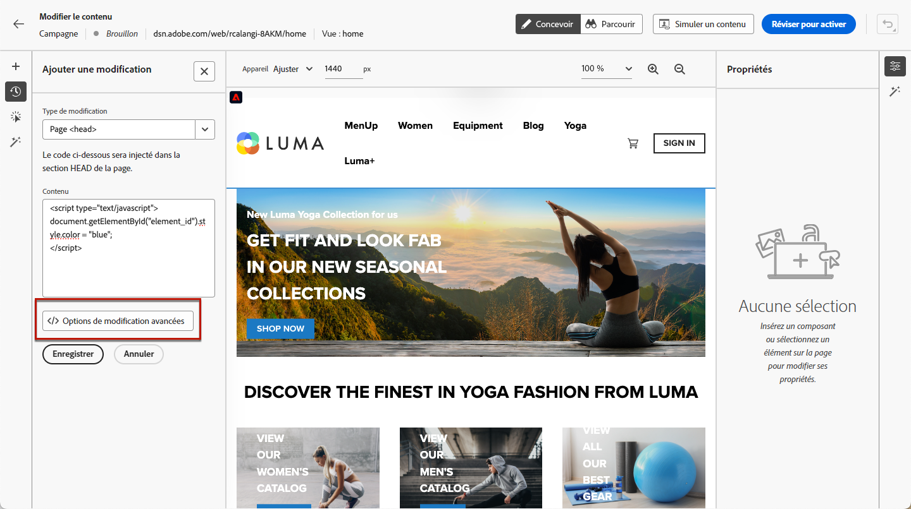

# Gérer les modifications web {#manage-web-modifications}

>[!CONTEXTUALHELP]
>id="ajo_web_designer_modifications"
>title="Gérer facilement toutes les modifications"
>abstract="Ce volet vous permet de parcourir et de gérer tous les réglages et styles ajoutés à votre page web."

Vous pouvez facilement gérer tous les composants, réglages et styles que vous avez ajoutés à votre page web. Vous pouvez également ajouter des modifications directement à partir du volet dédié.

## Utiliser le volet Modifications {#use-modifications-pane}

1. Sélectionnez l’icône **[!UICONTROL Modifications]** pour afficher le volet correspondant à gauche.

   

1. Vous pouvez passer en revue chacune des modifications que vous avez apportées à la page.

1. Sélectionnez une modification non souhaitée et cliquez sur l’option **[!UICONTROL Supprimer la modification]** à partir du bouton **[!UICONTROL Plus d’actions]** pour la supprimer.

   

   >[!CAUTION]
   >
   >Procédez avec précaution lors de la suppression d’une action, car elle peut avoir un impact sur les actions suivantes.

1. Pour supprimer plusieurs modifications en même temps, cliquez sur le bouton **[!UICONTROL Sélectionner]** en haut du volet **[!UICONTROL Modifications]**, vérifiez les modifications de votre choix et cliquez sur l’icône **[!UICONTROL Supprimer]**.

   

1. Cliquez sur le bouton **[!UICONTROL Plus dʼactions]** en haut du volet **[!UICONTROL Modifications]** pour supprimer toutes les modifications à la fois.

   

1. Vous pouvez également supprimer uniquement les modifications non valides, c’est-à-dire les modifications qui ont été remplacées par d’autres modifications. Par exemple, si vous modifiez la couleur d’un texte, puis que vous le supprimez, la modification de couleur devient non valide car le texte n’existe plus.

1. Vous pouvez annuler et rétablir des actions à l’aide du bouton **[!UICONTROL Annuler/rétablir]** en haut à droite de l’écran.

   

   Cliquez sur le bouton et maintenez-le enfoncé pour passer de l’option **[!UICONTROL Annuler]** à l’option **[!UICONTROL Rétablir]**, et inversement. Cliquez ensuite sur le bouton lui-même pour appliquer l’action souhaitée.

## Ajouter des modifications à partir du volet dédié {#add-modifications}

Lors de la modification d’une page à l’aide du concepteur web, vous pouvez ajouter de nouvelles modifications à votre contenu directement à partir du volet **[!UICONTROL Modifications]**, sans avoir à sélectionner un composant et à le modifier dans l’interface du concepteur web. Suivez les étapes ci-dessous.

1. Dans le volet **[!UICONTROL Modifications]**, cliquez sur le bouton **[!UICONTROL Plus d’actions]**.

1. Sélectionnez **[!UICONTROL Ajouter une modification]**.

   

1. Sélectionnez le type de modification :

   * **[!UICONTROL Sélecteur CSS]** - [En savoir plus](#css-selector)
   * **[!UICONTROL Page`<Head>`]** - [En savoir plus](#page-head)

1. Saisissez votre contenu et **[!UICONTROL enregistrez]** vos modifications.

1. Cliquez sur le bouton **[!UICONTROL Plus d’actions]** en regard de votre modification et sélectionnez **[!UICONTROL Infos]** pour afficher ses détails.

   

### Sélecteur CSS {#css-selector}

Pour ajouter une modification de type **Sélecteur CSS**, suivez les étapes ci-dessous.

1. Sélectionnez **[!UICONTROL Sélecteur CSS]** comme type de modification.

1. Le champ **[!UICONTROL Sélecteur d’éléments CSS]** vous aide à rechercher et à sélectionner les éléments HTML (ou les nœuds dans l’arborescence DOM) sur lesquels vous souhaitez appliquer les modifications. <!--specify the desired CSS element that you want to modify.-->

   

1. Sélectionnez un type d’action (**[!UICONTROL Définir le contenu]** ou **[!UICONTROL Définir l’attribut]**) et renseignez les informations/le contenu requis.

   * **[!UICONTROL Définir le contenu]** : indiquez le contenu qui va dans l’élément identifié par le champ **[!UICONTROL Sélecteur d’éléments CSS]**.

   * **[!UICONTROL Définir l’attribut]** : indiquez un attribut à associer au sélecteur CSS actuel afin que ce sélecteur puisse ensuite être également identifié par cet attribut. Pour ce faire, saisissez un nom dans le champ **[!UICONTROL Nom de l’attribut]** et une valeur dans le champ **[!UICONTROL Contenu]**. Si l’attribut existe déjà, la valeur est mise à jour; dans le cas contraire, un nouvel attribut est ajouté avec le nom et la valeur spécifiés.

     

### Page `<head>` {#page-head}

>[!CONTEXTUALHELP]
>id="ajo_web_designer_head"
>title="Ajouter un code personnalisé"
>abstract="L’élément HEAD est un conteneur pour les métadonnées et est placé entre la balise HTML et la balise BODY. Ajoutez uniquement les éléments SCRIPT et STYLE. L’ajout de balises DIV et d’autres éléments risque d’entraîner l’apparition des éléments HEAD restants dans la section BODY."

Vous pouvez ajouter du code personnalisé à l’aide du type de modification **[!UICONTROL Page`<head>`]**.

L’élément `<head>` est un conteneur pour les métadonnées et est placé entre la balise `<html>` et la balise `<body>`. Dans ce cas, le code n’attend pas les événements de chargement de page ou de corps, il est exécuté au début du chargement de la page.

L’élément `<head>` est généralement utilisé pour ajouter du code JavaScript ou CSS en haut de la page. Les sélecteurs pour les actions visuelles suivantes dépendent des éléments HTML ajoutés dans cet onglet.

Pour ajouter une modification de type **Page`<head>`**, suivez les étapes ci-dessous.

1. Sélectionnez **[!UICONTROL Page`<head>`]** comme type de modification.

   

1. Ajoutez votre code personnalisé dans la zone **[!UICONTROL Contenu]**.

   >[!CAUTION]
   >
   >Vous pouvez uniquement ajouter les éléments `<script>` et `<style>` à la section `<head>`. L’ajout de balises `<div>` et d’autres éléments risque d’entraîner l’apparition des éléments `<head>` restants dans la section `<body>`.

1. Cliquez sur le bouton **[!UICONTROL Options de modification avancées]**. L’éditeur de personnalisation s’ouvre.

   

   Vous pouvez utiliser la variable [!DNL Journey Optimizer] éditeur de personnalisation avec toutes ses fonctionnalités de personnalisation et de création. [En savoir plus](../personalization/personalization-build-expressions.md)

#### Exemples de code personnalisé {#custom-code-examples}

Vous pouvez utiliser le type de modification **[!UICONTROL Page`<head>`]** pour :

* Utilisez JavaScript intégré ou un lien vers un fichier JavaScript externe.

  Par exemple, pour modifier la couleur d’un élément :

  ```
  <script type="text/javascript">
  document.getElementById("element_id").style.color = "blue";
  </script>
  ```

* Configurez un style intégré ou un lien vers une feuille de style externe.

  Par exemple, pour définir une classe pour un élément de recouvrement :

  ```
  <style>
  .overlay
  { position: absolute; top:0; left: 0; right: 0; bottom: 0; background: red; }
  </style>
  ```

#### Bonnes pratiques relatives au code personnalisé {#custom-code-best-practices}

+++ **Enveloppez systématiquement le code personnalisé dans un élément.**

Par exemple :

```
<script>
// Code goes here
</script>
```

Si des modifications sont nécessaires, apportez des modifications dans ce conteneur.

Si vous n’avez plus besoin du code personnalisé, laissez ce conteneur vide, mais ne le supprimez pas. Cela permet de s’assurer que d’autres modifications d’expérience ne sont pas affectées.

+++

+++ **N’effectuez pas d’actions document.write dans les scripts de code personnalisé.**

Les scripts sont exécutés de manière asynchrone. Sinon, les actions document.write apparaissent souvent au mauvais endroit sur votre page. Utiliser document.write dans des scripts créés avec du code personnalisé n’est pas recommandé.

+++

+++ **Si vous créez un élément et que vous le modifiez par la suite, ne supprimez pas l’élément d’origine.**

Chaque modification crée un nouvel élément dans le panneau **[!UICONTROL Modifications]**. La deuxième action modifiant l’élément 1, si vous supprimez l’élément 1, cette action n’a plus rien à modifier, la modification ne fonctionne donc plus.

+++

+++ **Faites preuve de prudence lors de l’utilisation du type de modification**[!UICONTROL  Page `<head>`]**pour deux campagnes ayant un impact sur la même URL.**

Si vous utilisez le type de modification **[!UICONTROL Page`<head>`]** pour deux campagnes ayant un impact sur la même URL, le code JavaScript est injecté dans la page à partir des deux campagnes. [!DNL Journey Optimizer] détermine automatiquement l’ordre du contenu diffusé. Assurez-vous que le code ne dépend pas de l’emplacement. C’est à vous de vous assurer qu’il n’y a aucun conflit dans le code.

+++
