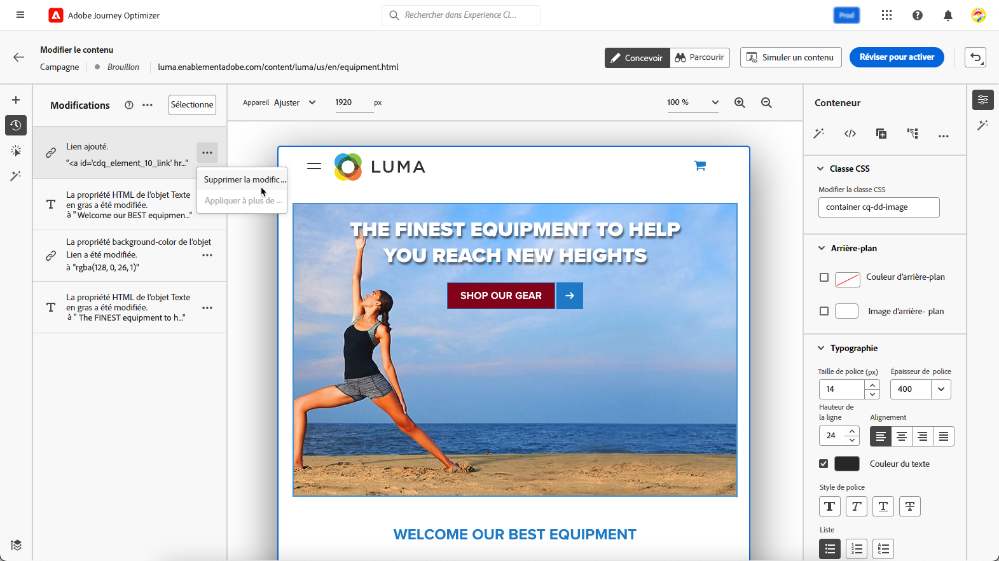
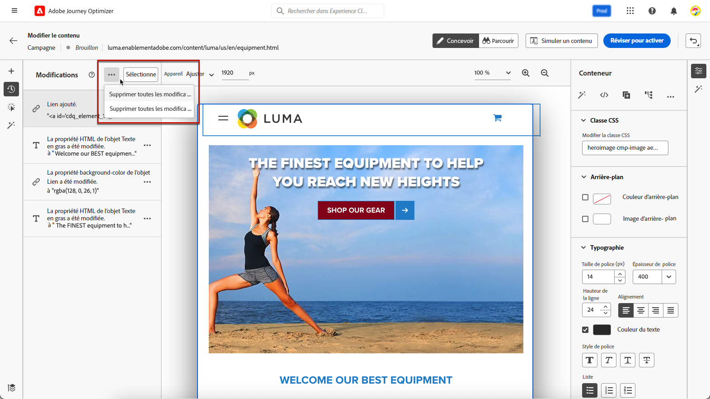

# Gestion des modifications web {#manage-web-modifications}

>[!CONTEXTUALHELP]
>id="ajo_web_designer_modifications"
>title="Gérer facilement toutes vos modifications"
>abstract="Ce volet vous permet de parcourir et de gérer tous les réglages et styles ajoutés à votre page web."

Vous pouvez facilement gérer tous les composants, réglages et styles que vous avez ajoutés à votre page web. Vous pouvez également ajouter des modifications directement à partir du volet dédié.

## Utilisation du volet Modifications {#use-modifications-pane}

1. Sélectionnez l’icône **[!UICONTROL Modifications]** pour afficher le volet correspondant à gauche.

   

1. Vous pouvez passer en revue chacune des modifications que vous avez apportées à la page.

1. Sélectionnez une modification indésirable et cliquez sur l’icône de suppression pour la supprimer.

   

   >[!CAUTION]
   >
   >Procédez avec précaution lors de la suppression d’une action, car elle peut avoir un impact sur les actions suivantes.

1. Cliquez sur le bouton **[!UICONTROL Plus dʼactions]** en haut du volet **[!UICONTROL Modifications]** pour supprimer toutes les modifications à la fois.

   

1. Dans le menu **[!UICONTROL Plus dʼactions]**, vous pouvez également supprimer uniquement les modifications non valides, c’est-à-dire les modifications qui ont été remplacées par d’autres modifications. Par exemple, si vous modifiez la couleur d’un texte, puis que vous le supprimez, la modification de couleur devient non valide car le texte n’existe plus.

1. Vous pouvez également annuler et rétablir des actions à l’aide du bouton **[!UICONTROL Annuler/rétablir]** en haut à droite de l’écran.

   

   Cliquez sur le bouton et maintenez-le enfoncé pour passer de l’option **[!UICONTROL Annuler]** à l’option **[!UICONTROL Rétablir]**, et inversement. Cliquez ensuite sur le bouton lui-même pour appliquer l’action souhaitée.
