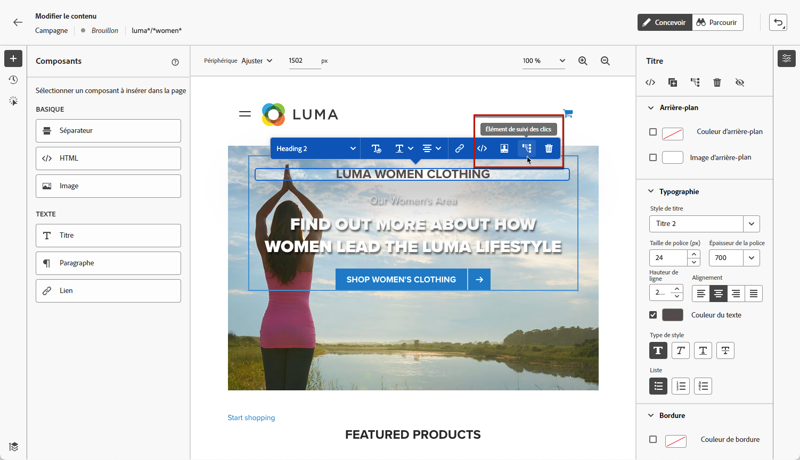
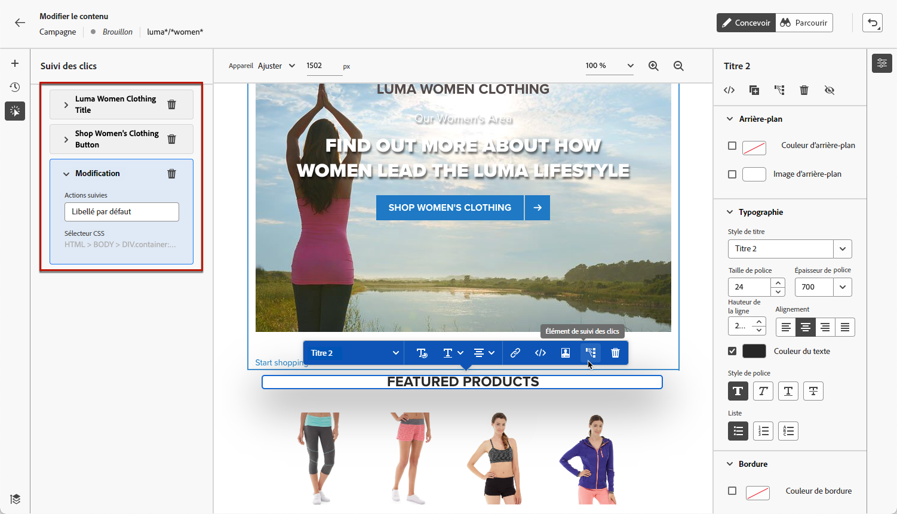

# Surveiller vos campagnes web {#monitor-web-campaigns}

## Vérifier les rapports web {#check-web-reports}

Une fois votre campagne activée, vous pouvez vérifier la variable **[!UICONTROL Web]** de rapports d&#39;opération pour comparer des éléments tels que le nombre d&#39;impressions, le taux de clics et le nombre d&#39;engagements à votre page web. En savoir plus sur le web de la campagne [rapport en direct](../reports/campaign-live-report.md#web-tab) et [rapport global](../reports/campaign-global-report.md#web-tab).

Pour améliorer davantage la surveillance de l’expérience web, vous pouvez également effectuer le suivi des clics sur n’importe quel élément spécifique de votre site web. Vous pouvez ainsi afficher le nombre de clics sur cet élément dans les rapports web. [Voici comment procéder.](#use-click-tracing)

## Utiliser le suivi des clics {#use-click-tracing}

Le concepteur web vous permet de sélectionner n’importe quel élément de votre site web et d’effectuer le suivi des clics sur cet élément.

Ces informations peuvent se révéler utiles pour améliorer l’expérience des utilisateurs et utilisatrices de votre site web. Par exemple, si les [rapports web](../reports/campaign-global-report.md#web-tab) affichent que de nombreux utilisateurs et utilisatrices cliquent sur un élément qui n’est pas réellement cliquable, vous pouvez ajouter un lien à cet élément.

1. Sélectionnez un élément dans votre page et choisissez **[!UICONTROL Clic sur l’élément de suivi]** dans le menu contextuel.

   

   >[!NOTE]
   >
   >Tout élément, cliquable ou non, peut être sélectionné.

1. L’action suivie correspondante s’affiche automatiquement dans le volet **[!UICONTROL Suivi des clics]** sur la gauche.

   

1. Ajoutez un libellé significatif pour gérer tous les éléments suivis et les retrouver facilement dans les rapports. Le **[!UICONTROL sélecteur CSS]** affiche des informations sur la localisation de l’élément sélectionné.

1. Répétez les étapes ci-dessus pour sélectionner autant d’autres éléments que nécessaire pour le suivi des clics. Les actions correspondantes sont toutes répertoriées dans le volet de gauche.

   

1. Pour supprimer le suivi des clics sur un élément, sélectionnez l’icône de suppression correspondante.

Une fois votre campagne activée, vous pouvez vérifier le nombre de clics pour chaque élément du Web de campagne. [rapport en direct](../reports/campaign-live-report.md#web-tab) et [rapport global](../reports/campaign-global-report.md#web-tab).
