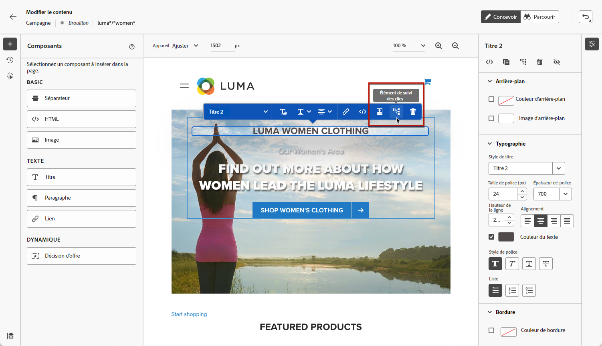
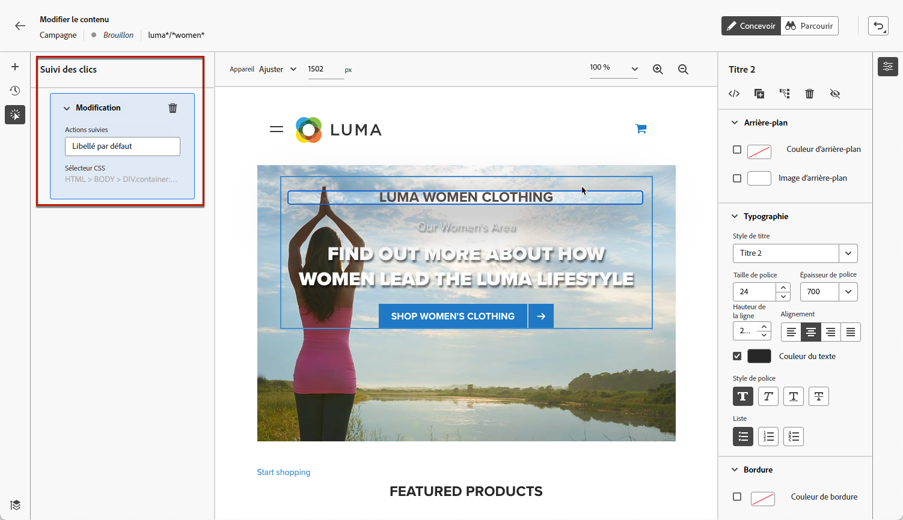
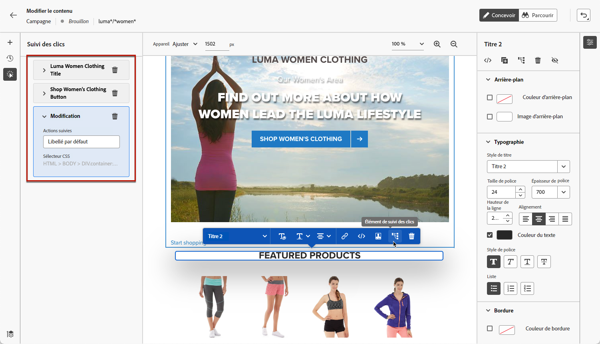

# Surveiller vos expériences web {#monitor-web-experiences}

>[!BEGINSHADEBOX]

**Sur cette page :** découvrez comment surveiller vos expériences web actives dans Adobe Journey Optimizer en vérifiant les rapports web et en configurant le suivi des clics sur des éléments de page spécifiques.

>[!ENDSHADEBOX]

## Vérifier les rapports web {#check-web-reports}

Une fois votre expérience web activée, vous pouvez vérifier l’onglet **[!UICONTROL Web]** du [rapport de parcours](../reports/journey-global-report-cja-web.md) et du [rapport de campagne](../reports/campaign-global-report-cja-web.md) pour comparer des éléments tels que le nombre d’impressions, le taux de clics et le nombre d’engagements de votre page web.

<!--You can check the **[!UICONTROL Web]** tab of the campaign reports. Learn more about the campaign web [live report](../reports/campaign-live-report.md#web-tab) and [global report](../reports/campaign-global-report-cja.md#web).-->

Pour améliorer davantage la surveillance de l’expérience web, vous pouvez également effectuer le suivi des clics sur n’importe quel élément spécifique de votre site web. Vous pouvez ainsi afficher le nombre de clics sur cet élément dans les rapports web. [Voici comment procéder.](#use-click-tracing)

## Utiliser le suivi des clics {#use-click-tracking}

>[!CONTEXTUALHELP]
>id="ajo_web_designer_click_tracking"
>title="Utiliser le suivi des clics"
>abstract="Effectuez le suivi des clics sur n’importe quel élément de votre page web pour surveiller les interactions utilisateur. Sélectionnez un élément, choisissez **Cliquer sur l’élément de suivi** dans le menu contextuel, puis ajoutez un libellé significatif. Les données suivies apparaissent dans vos rapports web, ce qui vous aide à comprendre comment les utilisateurs interagissent avec votre contenu."

Le designer web vous permet de sélectionner n’importe quel élément de votre site web et d’effectuer le suivi des clics sur cet élément.

Ces informations peuvent se révéler utiles pour améliorer l’expérience des utilisateurs et utilisatrices de votre site web. Par exemple, si les [rapports web](../reports/campaign-global-report-cja-web.md) affichent que de nombreux utilisateurs et utilisatrices cliquent sur un élément qui n’est pas réellement cliquable, vous pouvez ajouter un lien à cet élément.

1. Sélectionnez un élément dans votre page et choisissez **[!UICONTROL Clic sur l’élément de suivi]** dans le menu contextuel.

   

   >[!NOTE]
   >
   >Tout élément, cliquable ou non, peut être sélectionné.

1. L’action suivie correspondante s’affiche automatiquement dans le volet **[!UICONTROL Suivi des clics]** sur la gauche.

   

1. Ajoutez un libellé significatif pour gérer tous les éléments suivis et les retrouver facilement dans les rapports. Le **[!UICONTROL sélecteur CSS]** affiche des informations sur la localisation de l’élément sélectionné.

1. Répétez les étapes ci-dessus pour sélectionner autant d’autres éléments que nécessaire pour le suivi des clics. Les actions correspondantes sont toutes répertoriées dans le volet de gauche.

   

1. Pour supprimer le suivi des clics sur un élément, sélectionnez l’icône de suppression correspondante.

Une fois votre campagne activée, vous pouvez vérifier le nombre de clics sur chaque élément dans le [rapport dynamique](../reports/campaign-live-report.md#web-tab) et le [rapport Customer Journey Analytics](../reports/campaign-global-report-cja-web.md) de la campagne web.
