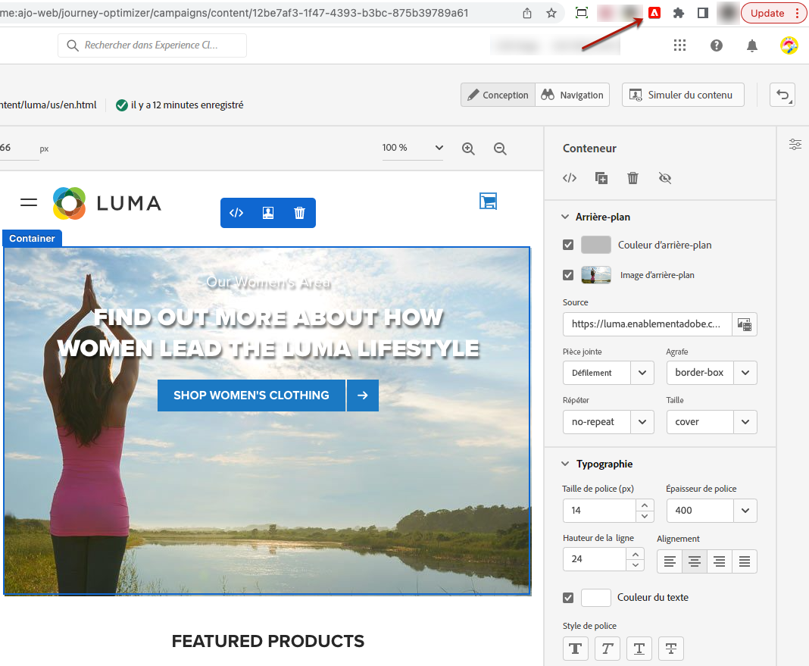

# Extension Visual Editing Helper {#visual-editing-helper}

Afin de rapidement créer et prévisualiser vos expériences web, l’extension de navigateur Visual Editing Helper d’Adobe Experience Cloud pour Google Chrome vous permet de charger des sites web de manière fiable dans le concepteur web d’Adobe [!DNL Journey Optimizer].

>[!NOTE]
>
>La fonctionnalité de canal web est actuellement disponible en version bêta pour certains utilisateurs uniquement.

## Installation de l’extension Visual Editing Helper {#install-visual-editing-helper}

Pour obtenir et installer l’extension de navigateur Visual Editing Helper, suivez les étapes ci-dessous.

1. Dans la boutique en ligne Google Chrome, accédez à l’extension de navigateur [Visual Editing Helper d’Adobe Experience Cloud](https://chrome.google.com/webstore/detail/adobe-experience-cloud-vi/kgmjjkfjacffaebgpkpcllakjifppnca){target=&quot;_blank&quot;}.

1. Cliquez sur **[!UICONTROL Ajouter à Chrome]** > **[!UICONTROL Ajouter l’extension]**.

1. Créez une campagne de canal web dans [!DNL Journey Optimizer]. [Voici comment procéder](author-web.md#create-web-campaign)

1. Ouvrez le concepteur web [!DNL Journey Optimizer] pour commencer à créer votre expérience web. [En savoir plus](author-web.md)

1. Assurez-vous que l’extension de navigateur Visual Editing Helper est activée dans la barre d’outils du navigateur Chrome en cliquant sur l’icône correspondante.

   

L’extension Visual Editing Helper d’Adobe Experience Cloud est désormais automatiquement activée lorsqu’un site web est ouvert dans le concepteur web [!DNL Journey Optimizer] pour optimiser la création.

L’extension ne dispose d’aucun paramètre conditionnel et gère automatiquement tous les paramètres, y compris les paramètres des cookies SameSite.

>[!NOTE]
>
>Certains sites web peuvent ne pas s’ouvrir de manière fiable dans le concepteur web [!DNL Journey Optimizer], et ce, pour l’une des raisons suivantes :
>
> * Le site Web possède des politiques strictes en matière de sécurité.
> * Le site Web se trouve dans un iframe.
> * Le site d’assurance qualité et/ou d’étape du client n’est pas disponible pour le grand public (site interne).

## Dépannage

Lors de l’utilisation du concepteur web d’Adobe [!DNL Journey Optimizer], si vous tentez de charger un site web et que ce chargement échoue, un message s’affiche vous suggérant d’installer l’[extension de navigateur Visual Editing Helper](#install-visual-editing-helper).

Si le SDK Web d’Adobe Experience Platform n’est pas encore implémenté sur le site web, un message s’affiche dans le concepteur web pour suggérer d’installer l’extension de navigateur Visual Editing Helper et d’implémenter le [SDK Web](https://experienceleague.adobe.com/docs/platform-learn/implement-web-sdk/overview.html?lang=fr){target=&quot;_blank&quot;}.

Si le site ne charge pas ou se comporte de manière inattendue, un correctif potentiel consiste à accepter les cookies sur votre site web dans le navigateur avant de tenter de le charger dans Adobe [!DNL Journey Optimizer].

Pour les pages sous authentification, si le chargement de la page de connexion échoue ou si, après avoir tenté de vous connecter, vous n’êtes toujours pas connecté, essayez d’abord de vous connecter dans un autre onglet de votre navigateur, puis chargez le site web dans le concepteur web d’Adobe [!DNL Journey Optimizer].
