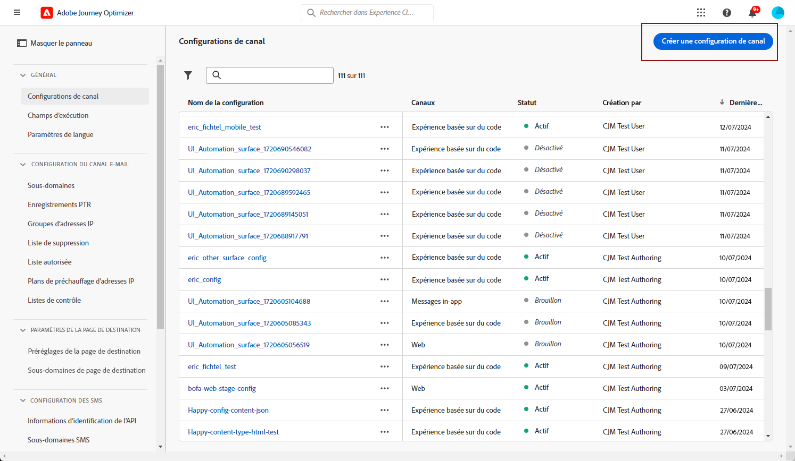
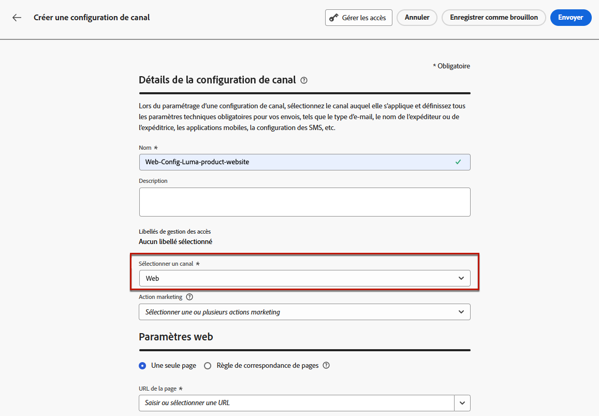
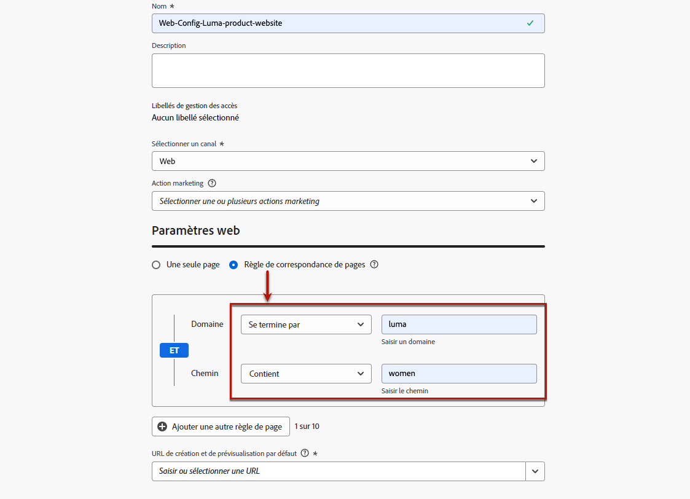
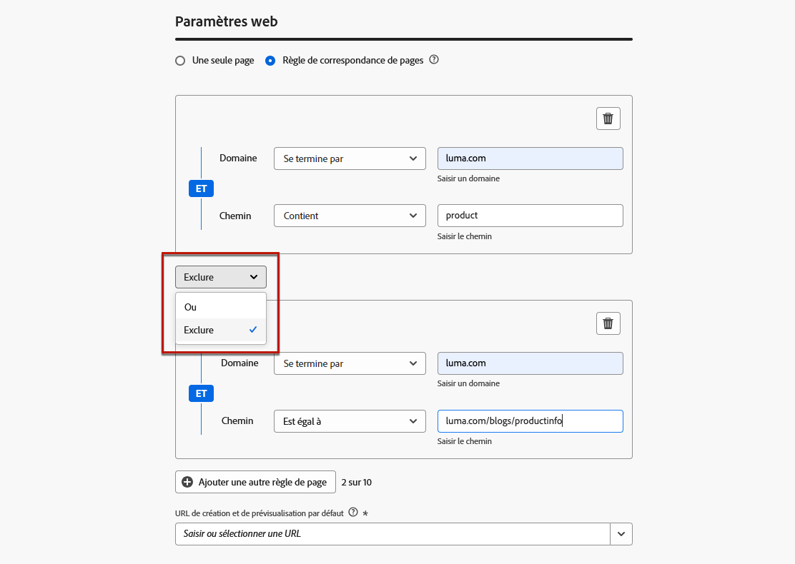

# Configuration des expériences web {#web-configuration}

## Création d’une configuration de canal web {#create-web-configuration}

Une configuration web est une propriété web identifiée par une URL où le contenu sera diffusé. Elle peut correspondre à l’URL d’une ou de plusieurs pages, ce qui vous permet de diffuser des modifications sur une ou plusieurs pages web.

Pour créer une configuration de canal web, procédez comme suit.

1. Accédez au menu **[!UICONTROL Canaux]** > **[!UICONTROL Paramètres généraux]** > **[!UICONTROL Configurations des canaux]**, puis cliquez sur **[!UICONTROL Créer une configuration des canaux]**.

   

1. Saisissez un nom et une description (facultatif) pour la configuration.

   >[!NOTE]
   >
   > Les noms doivent commencer par une lettre (A-Z). Ils ne peuvent contenir que des caractères alphanumériques. Vous pouvez également utiliser le trait de soulignement `_`, le point`.` et le trait d&#39;union `-`.

1. Pour attribuer des libellés d’utilisation des données personnalisés ou de base à la configuration, vous pouvez sélectionner **[!UICONTROL Gérer l’accès]**. [En savoir plus sur le contrôle d’accès au niveau de l’objet (OLAC)](../administration/object-based-access.md)

1. Sélectionnez le canal **Web**.

   

1. Sélectionnez une **[!UICONTROL Action marketing]** ou plusieurs pour associer des politiques de consentement aux messages utilisant cette configuration. Toutes les politiques de consentement associées à cette action marketing sont utilisées afin de respecter les préférences de vos clientes et clients. [En savoir plus](../action/consent.md#surface-marketing-actions)

1. Dans la section **[!UICONTROL Paramètres Web]**, sélectionnez l’une des options suivantes :

   * **[!UICONTROL Page unique]** - Si vous souhaitez appliquer les modifications uniquement à une seule page, saisissez une **[!UICONTROL URL de page]**.

   * **[!UICONTROL Règle de correspondance de pages]** - Pour cibler plusieurs URL correspondant à la même règle, créez une règle de correspondance de pages et saisissez une **[!UICONTROL URL de création et de prévisualisation par défaut]**. [En savoir plus](#web-page-matching-rule)

1. Cliquez sur **[!UICONTROL Envoyer]** pour enregistrer vos modifications.

Vous pouvez maintenant sélectionner cette configuration lorsque vous utilisez le canal web dans vos campagnes ou vos parcours.

## Création d’une règle de correspondance de pages {#web-page-matching-rule}

>[!CONTEXTUALHELP]
>id="ajo_admin_page_rule"
>title="Création d’une règle de correspondance de pages"
>abstract="Pour gérer et cibler efficacement un groupe d’URL qui partagent les mêmes critères, créez une règle de correspondance de pages. Cette règle permet de rassembler plusieurs URL sous une seule directive, ce qui simplifie l’application de paramètres et d’actions cohérents à ces pages."

>[!CONTEXTUALHELP]
>id="ajo_admin_default_url"
>title="Définir une URL pour la création et la prévisualisation de contenu"
>abstract="Ce champ garantit que les pages générées ou mises en correspondance par la règle ont une URL désignée, essentielle pour la création et la prévisualisation efficaces du contenu."

Lors de la création d’une configuration d’expérience web ou [basée sur du code](../code-based/get-started-code-based.md), vous pouvez créer une **[!UICONTROL règle de correspondance de pages]** pour cibler plusieurs URL correspondant à la même règle. Vous pouvez donc appliquer les mêmes modifications de contenu à plusieurs pages à la fois.

Par exemple, vous pouvez appliquer les modifications d’une bannière principale à l’ensemble d’un site web ou ajouter une image principale qui s’affiche sur toutes les pages produits d’un site web.

1. Lors de la configuration de votre expérience [web](#web-configuration) ou [basée sur du code](../code-based/code-based-configuration.md), sélectionnez **[!UICONTROL Règle de correspondance de pages]**.

1. Définissez vos critères pour les champs **[!UICONTROL Domaine]** et **[!UICONTROL Page]**.

   >[!NOTE]
   >
   >Consultez les opérateurs disponibles dans [cette section](#available-operators).

   Par exemple, si vous souhaitez modifier des éléments qui s’affichent sur toutes les pages produits pour femmes de votre site web Luma, sélectionnez **[!UICONTROL Domaine]** > **[!UICONTROL Commence par]** > `luma` et **[!UICONTROL Page]** > **[!UICONTROL Contient]** > `women`.

   

1. Si votre cas d’utilisation ne peut pas être mis en œuvre avec une seule règle, vous avez la possibilité d’ajouter plusieurs règles. Cliquez sur **[!UICONTROL Ajouter une autre règle de page]** et répétez l’étape ci-dessus.

   >[!NOTE]
   >
   >Vous pouvez ajouter jusqu’à 10 règles.

1. Vous pouvez utiliser les opérateurs **[!UICONTROL Ou]** ou **[!UICONTROL Exclure]** entre les différentes règles.

   **[!UICONTROL Exclure]** est utile lorsque l’une des pages correspondant à la règle définie ne doit pas être ciblée. Par exemple, vous pouvez cibler toutes les pages `luma.com` qui contiennent `product`, tout en excluant la page suivante : `https://luma.com/blogs/productinfo`.

   

1. Sélectionnez l’**[!UICONTROL URL de création et de prévisualisation par défaut]**. Cette étape permet de s’assurer que les pages générées ou mises en correspondance par la règle possèdent une URL désignée à des fins de création et de prévisualisation de contenu.

### Opérateurs disponibles pour créer des règles de correspondance de pages {#available-operators}

Lors de la création d’une [règle correspondant à plusieurs pages](#web-page-matching-rule), vous pouvez utiliser différents opérateurs sur les sections **[!UICONTROL Domaine]** et **[!UICONTROL Chemin]** pour créer la règle de votre choix. Les opérateurs disponibles sont répertoriés ci-dessous.

* **Domaine**

  | Opérateur | Description | Exemples |
  |---|---|---|
  | Correspond à | Correspondance exacte du domaine.  | |
  | Commence par | Correspond à tous les domaines (y compris les sous-domaines) commençant par la chaîne saisie.  | Exemple : « Commence par : dev » -> correspond à tous les domaines et sous-domaines commençant par « dev », comme : dev.exemple.com, dev.produits.exemple.com, developper.exemple.com. |
  | Se termine par | Correspond à tous les domaines (y compris les sous-domaines) qui se terminent par la chaîne saisie.  | Exemple : « Se termine par : exemple.com » -> correspond à tous les domaines et sous-domaines qui se terminent par « exemple.com », par exemple : stage.exemple.com, prod.exemple.com, monexemple.com. |
  | Correspondance des caractères génériques | L’opérateur « Correspondance des caractères génériques » permet de définir une correspondance de caractères génériques au milieu de la chaîne, comme « dev.*.exemple.com ». Les règles de validation sont telles que la valeur doit contenir un seul caractère générique (astérisque) lorsque l’opérateur est « correspondance des caractères génériques ».  | Exemple : « Correspondance des caractères génériques : dev.*.exemple.com » -> correspond à des domaines comme : dev.produits.exemple.com, dev.montest.produits.exemple.com, dev.blog.exemple.com. |
  | N’importe lequel | Correspond à tous les domaines. Cela se révèle utile lors du test d’un chemin spécifique sur plusieurs domaines. |  |

* **Chemin**

<table>
    <thead>
    <tr>
        <th><strong>Opérateur</th>
        <th><strong>Description</th>
        <th><strong>Exemples</th>
    </tr>
    </thead>
    <tbody>
    <tr>
        <td>Égal à</td>
        <td>Correspondance exacte du chemin. </td>
        <td></td>
    </tr>
    <tr>
        <td>Commence par</td>
        <td>Correspond à tous les chemins (y compris les sous-chemins) commençant par la chaîne saisie.</td>
        <td></td>
    </tr>
    <tr>
        <td>Se termine par</td>
        <td>Correspond à tous les chemins (y compris les sous-chemins) qui se terminent par la chaîne saisie.</td>
        <td></td>
    </tr>
    <tr>
        <td>N’importe lequel</td>
        <td>Correspond à tous les chemins. Cela se révèle utile lors du ciblage de tous les chemins sous un ou plusieurs domaines.</td>
        <td></td>
    </tr>
    <tr>
        <td>Correspondance des caractères génériques</td>
        <td>L’opérateur « Correspondance des caractères génériques » permet de définir un caractère générique interne à l’intérieur du chemin, comme « /produits/*/détail ».Le caractère générique * dans le composant Chemin ** correspond à n’importe quelle séquence de caractères avant de rencontrer le premier caractère /./*/ correspond à toute séquence de caractères (y compris les sous-chemins).</td>
        <td>Par exemple : « Correspondance générique : /produits/*/détail », correspond à tous les chemins tels que :<ul><li>exemple.com/produits/yoga/detail</li><li>exemple.com/produits/surf/detail</li><li>exemple.com/produits/tennis/detail</li><li>exemple.com/produits/yoga/pantalons/detail</li></ul>Par exemple : « Correspond à : /prod*/détail, correspond à tous les chemins tels que :<ul><li>exemple.com/produits/detail</li><li>exemple.com/production/detail</li></ul>ne correspond pas à des chemins tels que : <ul><li>exemple.com/produits/yoga/detail</li></ul></td>
    </tr>
    <tr>
        <td>Contient</td>
        <td>« Contient » est traduit en caractère générique comme « machaîne » et correspond à tous les chemins contenant cette séquence de caractères.</td>
        <td>Ex. : « Contient : produit », correspond à tous les chemins contenant le produit sous forme de chaîne, tels que :<ul><li>exemple.com/produits</li><li>exemple.com/yoga/produitperf</li><li>exemple.com/surf/descriptionproduit</li><li>exemple.com/accueil/produits/page</li></ul></td>
    </tr>
    </tbody>
</table>
