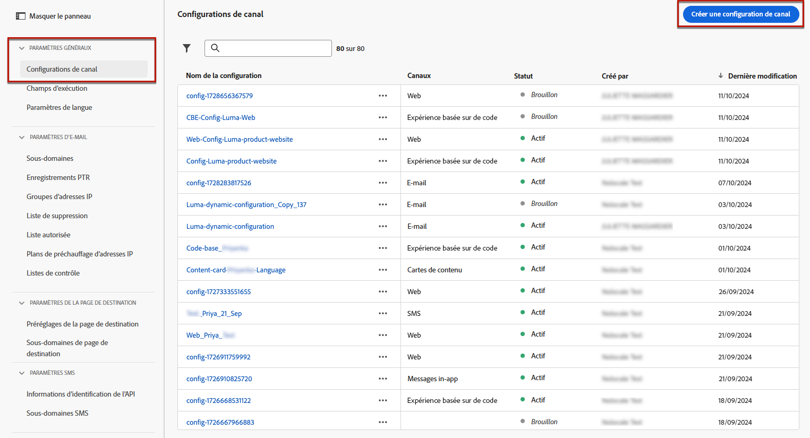

# Création d’une configuration de canal web {#web-configuration}

>[!CONTEXTUALHELP]
>id="ajo_admin_page_rule"
>title="Règle de correspondance de pages"
>abstract="Pour gérer et cibler efficacement un groupe d’URL qui partagent les mêmes critères, créez une règle de correspondance Pages . Cette règle vous permet de consolider plusieurs URL sous une seule directive, ce qui simplifie l’application de paramètres et d’actions cohérents sur ces pages."

>[!CONTEXTUALHELP]
>id="ajo_admin_default_url"
>title="URL de création et de prévisualisation par défaut"
>abstract="Ce champ garantit que les pages générées ou mises en correspondance par la règle ont une URL désignée, essentielle pour la création et la prévisualisation efficaces du contenu."

Une configuration web est une propriété web identifiée par une URL où le contenu sera diffusé. Elle peut correspondre à l’URL d’une ou de plusieurs pages, ce qui vous permet de diffuser des modifications sur une ou plusieurs pages web.

1. Accédez au menu **[!UICONTROL Canaux]** > **[!UICONTROL Paramètres généraux]** > **[!UICONTROL Configurations de canaux]** , puis cliquez sur **[!UICONTROL Créer une configuration de canal]**.

   

1. Saisissez un nom et une description (facultatif) pour la configuration.

   >[!NOTE]
   >
   > Les noms doivent commencer par une lettre (A-Z). Ils ne peuvent contenir que des caractères alphanumériques. Vous pouvez également utiliser le trait de soulignement `_`, le point`.` et le trait d&#39;union `-`.

1. Pour attribuer des libellés d’utilisation des données personnalisés ou de base à la configuration, vous pouvez sélectionner **[!UICONTROL Gérer l’accès]**. [En savoir plus sur le contrôle d’accès au niveau de l’objet (OLAC)](../administration/object-based-access.md).

1. Sélectionnez le canal **Web**.

   

1. Sélectionnez **[!UICONTROL Action marketing]** pour associer les stratégies de consentement aux messages utilisant cette configuration. Toutes les stratégies de consentement associées à l’action marketing sont exploitées afin de respecter les préférences de vos clients. [En savoir plus](../action/consent.md#surface-marketing-actions)

1. Vous pouvez saisir une **[!UICONTROL URL de la page]** si vous souhaitez appliquer les modifications à une seule page uniquement.

1. Vous pouvez également créer une **[!UICONTROL Règle de correspondance de pages]** pour cibler plusieurs URL correspondant à la même règle, notamment si vous souhaitez appliquer les modifications à une bannière principale sur l’ensemble d’un site web ou ajouter une image principale qui s’affiche sur toutes les pages de produits d’un site web.

   Pour ce faire, sélectionnez **[!UICONTROL Pages correspondant à la règle]**.

1. Définissez vos critères pour les champs **[!UICONTROL Domaine]** et **[!UICONTROL Page]**.

   Par exemple, si vous souhaitez modifier des éléments qui s’affichent sur toutes les pages de produits pour femmes de votre site web Luma, sélectionnez **[!UICONTROL Domaine]** > **[!UICONTROL Commence par]** > `luma` et **[!UICONTROL Page]** > **[!UICONTROL Contient]** > `women`.

   

1. Si vous avez créé une **[!UICONTROL règle de correspondance de page]**, vous devez saisir l’URL de création et d’aperçu **par défaut**. Cette étape permet de s’assurer que les pages générées ou mises en correspondance par la règle possèdent une URL désignée à des fins de création et d’aperçu de contenu. Pour en savoir plus sur la règle de correspondance de page, consultez la [section ci-dessous](#web-page-matching-rule).

1. Enregistrez vos modifications.

Vous pouvez maintenant sélectionner votre configuration lorsque vous utilisez le canal web dans les campagnes ou les parcours.

## Règle de correspondance de page {#web-page-matching-rule}

Lors de la création d’une règle qui correspond à plusieurs pages afin que vous puissiez appliquer les mêmes modifications de contenu sur plusieurs pages à la fois, vous pouvez utiliser différents opérateurs sur les sections **Domaine** et **Chemin** pour créer la règle de votre choix. Vérifiez les opérateurs disponibles ci-dessous.

Opérateurs disponibles pour créer des règles de mise en correspondance de pages :

* **Domaine**

  | Opérateur  | Description  | Exemples  |
  |---|---|---|
  | Est égal à  | Correspondance exacte du domaine.  |
  | Commence par  | Correspond à tous les domaines (y compris les sous-domaines) commençant par la chaîne saisie.  | Ex : &quot;Commence par : dev&quot; -> correspond à tous les domaines et sous-domaines commençant par &quot;dev&quot;, comme : dev.example.com, dev.products.example.com, developer.example.com  |
  | Se termine par  | Correspond à tous les domaines (y compris les sous-domaines) qui se terminent par la chaîne saisie.  | Ex : &quot;Se termine par : example.com&quot; -> correspond à tous les domaines et sous-domaines qui se terminent par &quot;example.com&quot;, par exemple : stage.example.com, prod.example.com, myexample.com  |
  | Correspondance avec les caractères génériques  | L’opérateur &quot;Correspondance de caractères génériques&quot; permet à l’utilisateur de définir une correspondance de caractères génériques au milieu de la chaîne, comme &quot;dev&quot;.*.example.com&quot;. Les règles de validation sont que la valeur doit contenir un seul caractère générique (astérisque) lorsque l’opérateur est &quot;correspondance de caractères génériques&quot;.  | Ex : &quot;Correspondance générique : dev.*.example.com&quot; -> correspond à des domaines tels que : dev.products.example.com, dev.mytest.products.example.com, dev.blog.example.com  |
  | Quelconque  | Correspond à tous les domaines. Cela s’avère utile lors du test d’un chemin spécifique sur plusieurs domaines.  |

* **Chemin**

  | | | |
  |-|-|-|
  | Opérateur  | Description  | Exemples  |
  | Est égal à  | Correspondance exacte du chemin.  |    |
  | Commence par  | Correspond à tous les chemins (y compris les sous-chemins) commençant par la chaîne saisie.  |    |
  | Se termine par  | Correspond à tous les chemins (y compris les sous-chemins) qui se terminent par la chaîne saisie.  |    |
  | Quelconque  | Correspond à tous les chemins d’accès. Cela s’avère utile lors du ciblage de tous les chemins d’accès sous un ou plusieurs domaines.  |    |
  | Correspondance avec les caractères génériques  | L’opérateur &quot;Correspondance de caractères génériques&quot; permet à l’utilisateur de définir un caractère générique interne à l’intérieur du chemin, comme &quot;/products/*/detail&quot;.  Le caractère générique * dans le composant Chemin ** correspond à n’importe quelle séquence de caractères jusqu’à ce que le premier / caractère soit rencontré.  /*/ correspond à toute séquence de caractères (y compris les sous-chemins)  | Ex : &quot;Correspondance générique : /products/*/detail&quot;, correspond à tous les chemins tels que :  example.com/products/yoga/detail  example.com/products/surf/detail  example.com/products/tennis/detail  example.com/products/yoga/pants/detail   Ex : &quot;Correspond à : /prod*/detail, correspond à tous les chemins tels que :  example.com/products/detail  example.com/production/detail   ne correspond pas aux chemins tels que :  example.com/products/yoga/detail  |
  | Contient  | &quot;contains&quot; est traduit en caractère générique comme &quot;mystring&quot; et correspond à tous les chemins contenant cette séquence de caractères.  | Ex : &quot;Contains : product&quot;, correspond à tous les chemins contenant le produit de chaîne, tels que : example.com/products, example.com/yoga/perfproduct, example.com/surf/productdescription, example.com/home/product/page  |

Si votre cas d’utilisation ne peut pas être modélisé à l’aide d’une règle, vous avez la possibilité d’ajouter plusieurs règles de page et vous pouvez utiliser des opérateurs &quot;Ou&quot; ou &quot;Exclure&quot; entre elles. &quot;Exclure&quot; est utile lorsque l’une des pages correspondant à la règle définie ne doit pas être ciblée : par exemple, toutes les pages &quot;example.com&quot; qui contiennent &quot;product&quot;, à l’exception de la page suivante : `https://example.com/blogs/productinfo`.