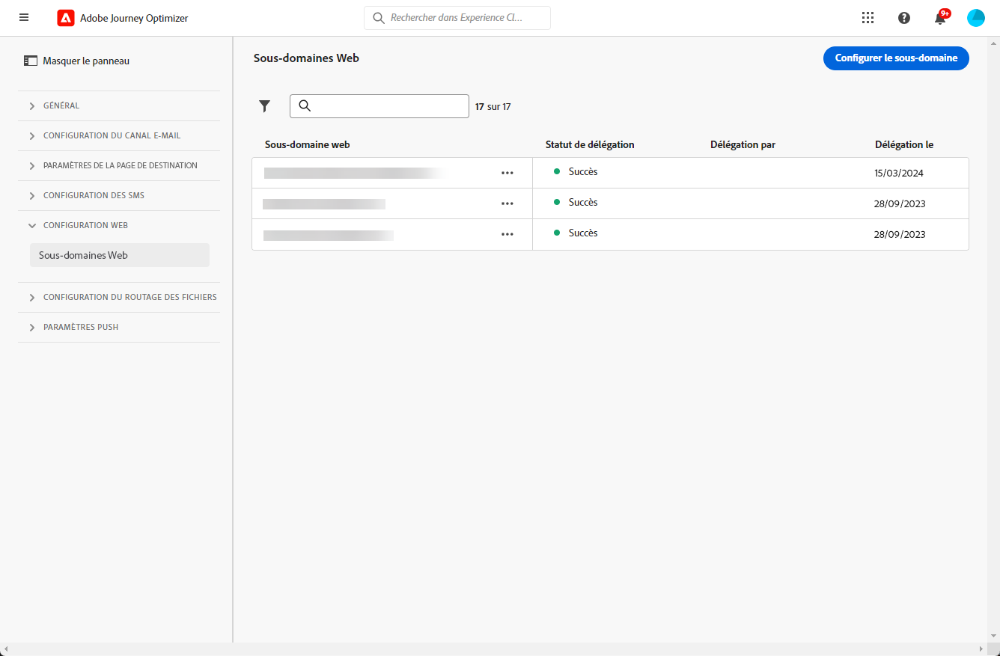

# Configurer des sous-domaines web {#web-subdomains}

>[!CONTEXTUALHELP]
>id="ajo_admin_subdomain_web_header"
>title="Déléguer un sous-domaine web"
>abstract="Votre tâche consiste à configurer votre sous-domaine pour le canal web. Vous pouvez utiliser un sous-domaine déjà délégué à Adobe ou en configurer un autre."

>[!CONTEXTUALHELP]
>id="ajo_admin_subdomain_web"
>title="Déléguer un sous-domaine web"
>abstract="Si vous ajoutez du contenu provenant d’Adobe Experience Manager Assets Essentials à vos expériences web, vous devez configurer le sous-domaine qui sera utilisé pour publier ce contenu. Effectuez une sélection parmi les sous-domaines déjà délégués à l’Adobe ou configurez un nouveau sous-domaine."

>[!CONTEXTUALHELP]
>id="ajo_admin_subdomain_web_default"
>title="Définir un sous-domaine web"
>abstract="Sélectionnez un sous-domaine dans la liste des sous-domaines délégués à Adobe. Vous pouvez définir ce sous-domaine web comme sous-domaine par défaut, mais un seul sous-domaine par défaut peut être utilisé à la fois."

Lors de la création d’expériences web, si vous ajoutez du contenu provenant de la bibliothèque d’[Adobe Experience Manager Assets Essentials](../content-management/assets-essentials.md), vous devez configurer le sous-domaine qui sera utilisé pour publier ce contenu.

Vous pouvez utiliser un sous-domaine déjà délégué à Adobe ou en configurer un autre. En savoir plus sur la délégation de sous-domaines à Adobe dans [cette section](../configuration/delegate-subdomain.md).

>[!CAUTION]
>
>La configuration de sous-domaines web est identique dans tous les environnements. Par conséquent :
>
>* Pour accéder aux sous-domaines web et les modifier, vous devez disposer de l’autorisation **[!UICONTROL Gérer les sous-domaines]** dans la sandbox de production.
>
> * Toute modification apportée à un sous-domaine web aura également un impact sur les sandbox de production.

Vous pouvez créer plusieurs sous-domaines web, mais seul le sous-domaine **par défaut** sera utilisé. Vous pouvez modifier le sous-domaine web par défaut, mais un seul sous-domaine peut être utilisé à la fois.

## Accès et gestion des sous-domaines web {#access-web-subdomains}

1. Accédez au **[!UICONTROL Administration]** > **[!UICONTROL Canaux]** , puis sélectionnez **[!UICONTROL Configuration web]** > **[!UICONTROL Sous-domaines web]**. Tous les sous-domaines configurés avec l’environnement de test actuel s’affichent.

   

1. Vous pouvez filtrer selon l’utilisateur qui a délégué chaque sous-domaine ou l’état de délégation (**[!UICONTROL Version préliminaire]**, **[!UICONTROL Traitement]**, **[!UICONTROL Succès]** ou **[!UICONTROL En échec]**).

   

1. Le badge **[!UICONTROL Par défaut]** s’affiche en regard du sous-domaine actuellement utilisé par défaut. Pour modifier le sous-domaine par défaut, sélectionnez **[!UICONTROL Définir comme valeur par défaut]** en cliquant sur le bouton **[!UICONTROL Plus d’actions]** en regard du sous-domaine souhaité.

   

   >[!NOTE]
   >
   >Vous pouvez modifier le sous-domaine web par défaut, mais un seul sous-domaine peut être utilisé à la fois.

## Utiliser un sous-domaine existant {#web-use-existing-subdomain}

Pour utiliser un sous-domaine déjà délégué à Adobe, procédez comme suit.

1. Accédez au menu **[!UICONTROL Administration]** > **[!UICONTROL Canaux]**, puis sélectionnez **[!UICONTROL Configuration web]** > **[!UICONTROL Sous-domaines web]**.

1. Cliquez sur **[!UICONTROL Configurer le sous-domaine]**.

1. Sélectionnez la variable **[!UICONTROL Utilisation d’un sous-domaine délégué]** de l’option **[!UICONTROL Type de configuration]** et sélectionnez un sous-domaine délégué dans la liste.

   

   >[!NOTE]
   >
   >Vous ne pouvez pas sélectionner un sous-domaine déjà utilisé comme sous-domaine web.

1. Le préfixe qui s’affichera dans votre URL web est automatiquement ajouté. Vous ne pouvez pas le modifier.

1. Pour définir ce sous-domaine par défaut, sélectionnez l’option correspondante.

   

   >[!NOTE]
   >
   >Seul le sous-domaine **par défaut** sera utilisé.

1. Cliquez sur **[!UICONTROL Envoyer]**. Le sous-domaine obtient le statut **[!UICONTROL Succès]**. Il est prêt à être utilisé avec vos expériences web.

   >[!NOTE]
   >
   >Dans de très rares occasions, une configuration de sous-domaine peut échouer. Dans ce cas, vous pouvez supprimer le sous-domaine en **[!UICONTROL échec]** pour nettoyer la liste à l’aide du bouton **[!UICONTROL Supprimer]** à partir de l’icône **[!UICONTROL Plus d’actions]**.

## Configurer un nouveau sous-domaine {#web-configure-new-subdomain}

>[!CONTEXTUALHELP]
>id="ajo_admin_web_subdomain_dns"
>title="Générer l’enregistrement DNS correspondant"
>abstract="Pour configurer un nouveau sous-domaine web, vous devez copier les informations du serveur de noms d’Adobe affichées dans l’interface de Journey Optimizer et les coller dans votre solution d’hébergement de domaine pour générer l’enregistrement DNS correspondant. Une fois les vérifications effectuées, le sous-domaine est prêt à être utilisé pour publier du contenu provenant de la bibliothèque Experience Manager Assets Essentials."

Pour configurer un nouveau sous-domaine, procédez comme suit :

1. Accédez au **[!UICONTROL Administration]** > **[!UICONTROL Canaux]** , puis sélectionnez **[!UICONTROL configuration web]** > **[!UICONTROL sous-domaines web]**.

1. Cliquez sur **[!UICONTROL Configurer un sous-domaine]**.

1. Sélectionnez **[!UICONTROL Ajouter votre propre domaine]** de la section **[!UICONTROL Type de configuration]**.

1. Spécifiez le sous-domaine à déléguer.

   >[!CAUTION]
   >
   >Vous ne pouvez pas utiliser un sous-domaine web existant.
   >
   >Les majuscules ne sont pas autorisées dans les sous-domaines.

   

   La délégation d’un sous-domaine non valide à Adobe n’est pas autorisée. Veillez à saisir un sous-domaine valide détenu par votre entreprise, tel que marketing.votre_entreprise.com.

   >[!NOTE]
   >
   >Les sous-domaines à plusieurs niveaux (du même domaine parent) sont pris en charge. Par exemple, vous pouvez utiliser &#39;web.marketing.votreentreprise.com&#39;.

1. Pour définir ce sous-domaine par défaut, sélectionnez l’option correspondante.

   >[!NOTE]
   >
   >Seul le sous-domaine **par défaut** sera utilisé.

1. L’enregistrement à placer dans les serveurs DNS s’affiche. Copiez cet enregistrement ou téléchargez un fichier CSV, puis accédez à votre solution d’hébergement de domaine pour générer l’enregistrement DNS correspondant.

1. Assurez-vous que l’enregistrement DNS a été généré dans votre solution d’hébergement de domaine. Si tout est correctement configuré, cochez la case « Je confirme... », puis cliquez sur **[!UICONTROL Envoyer]**.

   

   >[!NOTE]
   >
   >Lorsque vous configurez un nouveau sous-domaine web, il pointe toujours vers un enregistrement CNAME.

1. Une fois la délégation de sous-domaine envoyée, le sous-domaine s&#39;affiche dans la liste avec le statut **[!UICONTROL Traitement]**. Pour en savoir plus sur les statuts des sous-domaines, consultez [cette section](../configuration/about-subdomain-delegation.md#access-delegated-subdomains).<!--Same statuses?-->

   >[!NOTE]
   >
   >Avant de pouvoir utiliser ce sous-domaine pour envoyer des messages web, vous devez attendre que l’Adobe effectue les vérifications requises, qui peuvent prendre jusqu’à 4 heures.

1. Une fois les vérifications effectuées, le sous-domaine obtient le statut **[!UICONTROL Succès]**. Il est prêt à être utilisé pour créer des surfaces de canal web.

   Le statut du sous-domaine sera marqué comme en **[!UICONTROL Échec]** si la création de lʼenregistrement de validation sur votre solution dʼhébergement nʼa pas réussi.

<!--
Only a subdomain with the **[!UICONTROL Success]** status can be set as default.
You cannot delete a subdomain with the **[!UICONTROL Processing]** status.
-->