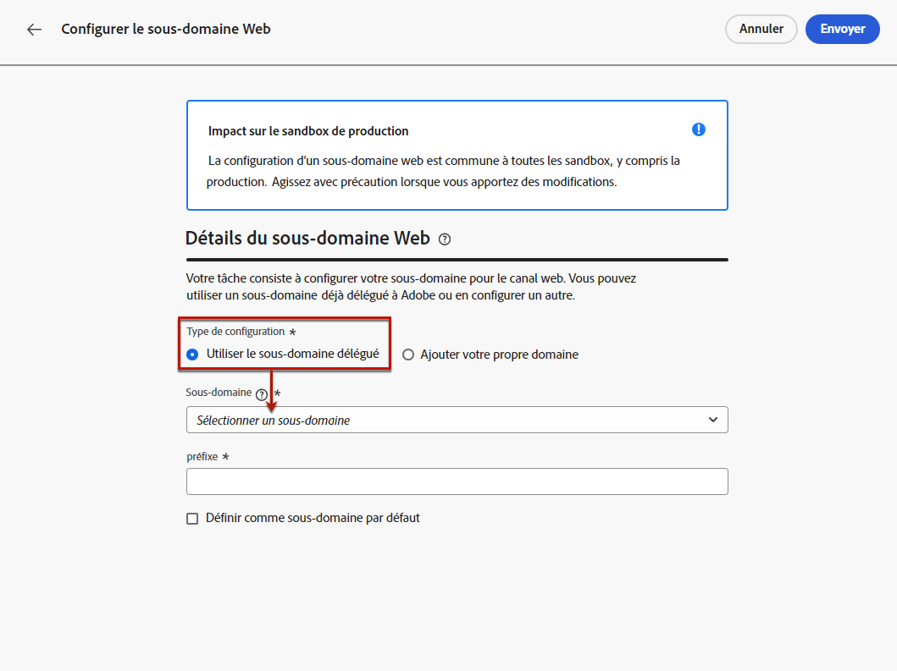

# Configurer des sous-domaines web {#web-subdomains}

>[!CONTEXTUALHELP]
>id="ajo_admin_subdomain_web_header"
>title="Déléguer un sous-domaine web"
>abstract="Votre tâche consiste à configurer votre sous-domaine pour le canal web. Faites votre choix parmi les sous-domaines déjà délégués à Adobe."

>[!CONTEXTUALHELP]
>id="ajo_admin_subdomain_web"
>title="Déléguer un sous-domaine web"
>abstract="Si vous ajoutez du contenu provenant d’Adobe Experience Manager Assets Essentials à vos expériences web, vous devez configurer le sous-domaine qui sera utilisé pour publier ce contenu. Sélectionnez parmi les sous-domaines déjà délégués à Adobe."

>[!CONTEXTUALHELP]
>id="ajo_admin_subdomain_web_default"
>title="Définir un sous-domaine web"
>abstract="Sélectionnez un sous-domaine dans la liste des sous-domaines délégués à Adobe. Vous pouvez définir ce sous-domaine web comme sous-domaine par défaut, mais un seul sous-domaine par défaut peut être utilisé à la fois."

Lors de la création d’expériences web, si vous ajoutez du contenu provenant de la bibliothèque d’[Adobe Experience Manager Assets Essentials](../content-management/assets-essentials.md), vous devez configurer le sous-domaine qui sera utilisé pour publier ce contenu.

Pour ce faire, vous devez effectuer une sélection dans la liste des sous-domaines déjà délégués à Adobe. En savoir plus sur la délégation de sous-domaines à Adobe dans [cette section](../configuration/delegate-subdomain.md).

>[!CAUTION]
>
>La configuration de sous-domaines web est identique dans tous les environnements. Par conséquent :
>
>* Pour accéder aux sous-domaines web et les modifier, vous devez disposer de l’autorisation **[!UICONTROL Gérer les sous-domaines]** dans la sandbox de production.
>
> * Toute modification apportée à un sous-domaine web aura également un impact sur les sandbox de production.

Vous pouvez créer plusieurs sous-domaines web, mais seul le sous-domaine **par défaut** sera utilisé. Vous pouvez modifier le sous-domaine web par défaut, mais un seul sous-domaine peut être utilisé à la fois.

1. Accédez au menu **[!UICONTROL Administration]** > **[!UICONTROL Canaux]**, puis sélectionnez **[!UICONTROL Configuration web]** > **[!UICONTROL Sous-domaines web]**.

   

1. Cliquez sur **[!UICONTROL Configurer le sous-domaine]**.

1. Sélectionnez un sous-domaine délégué dans la liste.

   

   >[!NOTE]
   >
   >Vous ne pouvez pas sélectionner un sous-domaine déjà utilisé comme sous-domaine web.

1. Le préfixe qui s’affichera dans votre URL web est automatiquement ajouté. Vous ne pouvez pas le modifier.

1. Pour définir ce sous-domaine par défaut, sélectionnez l’option correspondante.

   

   >[!NOTE]
   >
   >Seul le sous-domaine **par défaut** sera utilisé.

1. Cliquez sur **[!UICONTROL Envoyer]**. Le sous-domaine obtient le statut **[!UICONTROL Succès]**. Il est prêt à être utilisé avec vos expériences web.

   >[!NOTE]
   >
   >Dans de très rares occasions, une configuration de sous-domaine peut échouer. Dans ce cas, vous pouvez supprimer le sous-domaine en **[!UICONTROL échec]** pour nettoyer la liste à l’aide du bouton **[!UICONTROL Supprimer]** à partir de l’icône **[!UICONTROL Plus d’actions]**.

1. Le badge **[!UICONTROL Par défaut]** s’affiche en regard du sous-domaine actuellement utilisé par défaut. Pour modifier le sous-domaine par défaut, sélectionnez **[!UICONTROL Définir comme valeur par défaut]** en cliquant sur le bouton **[!UICONTROL Plus d’actions]** en regard du sous-domaine souhaité.

   

   >[!NOTE]
   >
   >Vous pouvez modifier le sous-domaine web par défaut, mais un seul sous-domaine peut être utilisé à la fois.

   <!--Only a subdomain with the **[!UICONTROL Success]** status can be set as default.

    You cannot delete a subdomain with the **[!UICONTROL Processing]** status.-->
