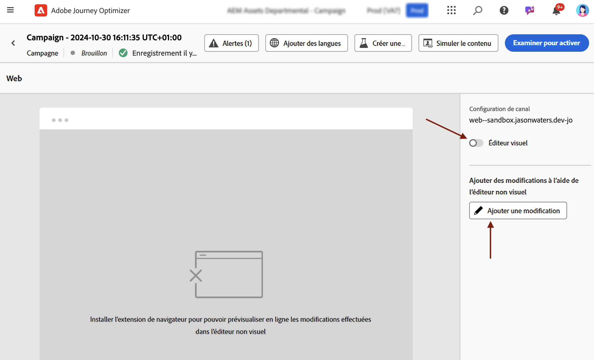
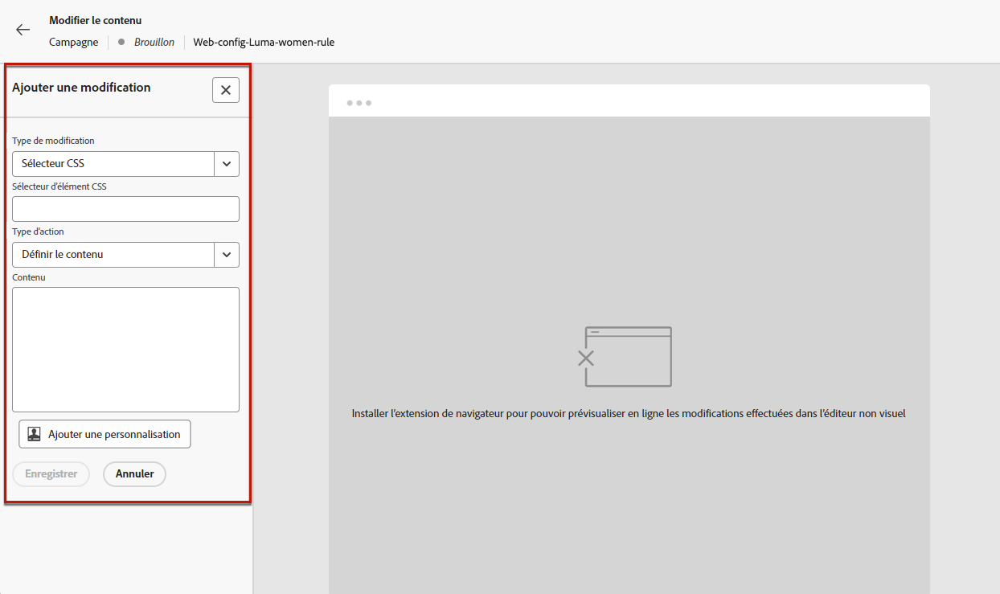
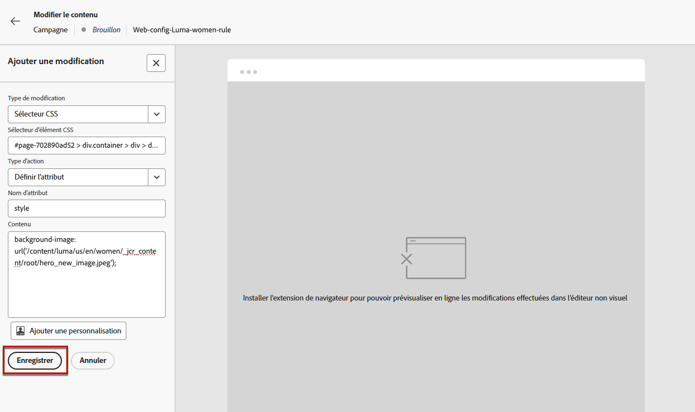
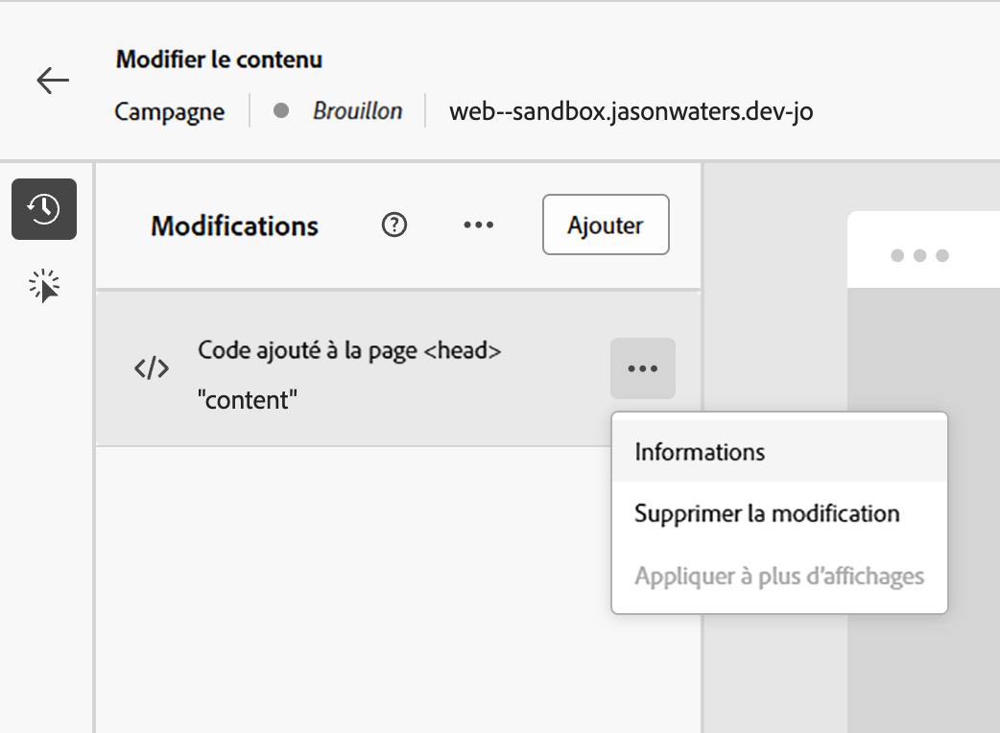
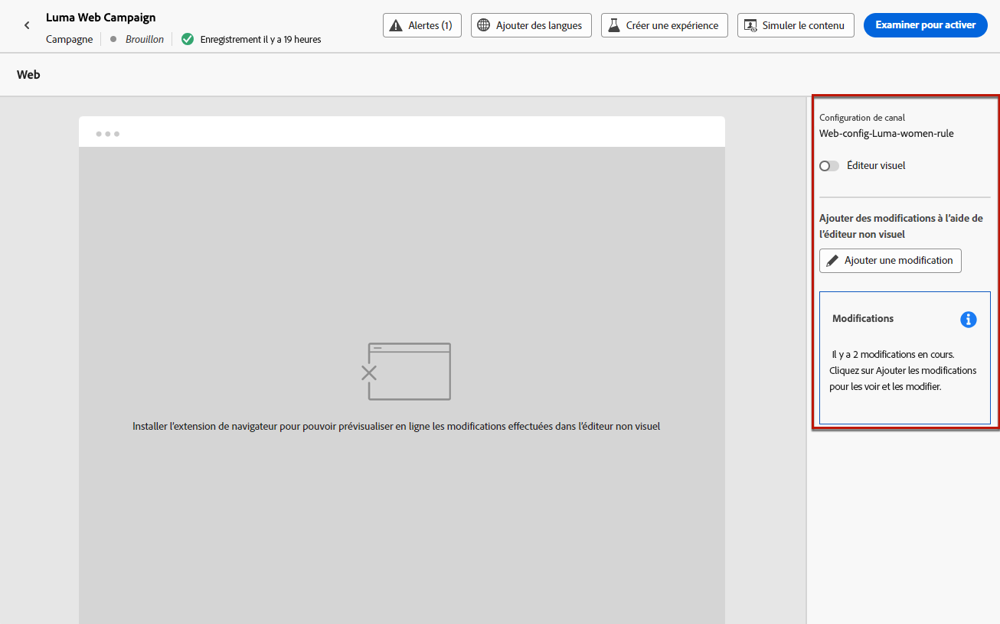
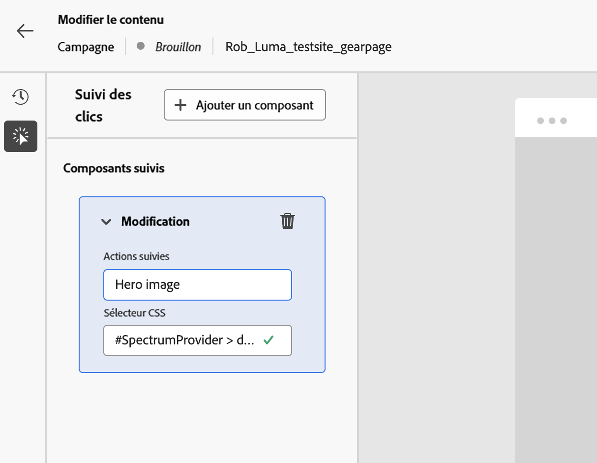

# Utilisation de l’éditeur non visuel web {#web-non-visual-editor}

Outre le [!DNL Journey Optimizer] concepteur visuel [web designer](web-visual-editor.md), vous pouvez également ajouter des modifications à vos pages web à l’aide d’un **éditeur non visuel**.

Cela peut s’avérer utile si vous ne pouvez pas, ou n’êtes pas autorisé, installer des extensions de navigateur telles que l’ [assistant visuel Adobe Experience Cloud](web-prerequisites.md#visual-authoring-prerequisites), nécessaire pour charger vos pages dans le concepteur web.

Dans certains cas, il peut également être plus facile d’utiliser un éditeur non visuel pour appliquer des modifications à un sélecteur CSS particulier, sans risque de modifier d’autres éléments d’une page web ou de modifier la structure de la page.

Pour créer vos expériences web avec l’éditeur non visuel, procédez comme suit.

1. Dans l&#39;écran **[!UICONTROL Modifier le contenu]** du parcours ou de la campagne, désélectionnez l&#39;option **[!UICONTROL Éditeur visuel]** .

1. Cliquez sur **[!UICONTROL Ajouter une modification]** pour commencer à modifier votre contenu web.

   

1. L’éditeur non visuel s’affiche. Vous pouvez ajouter votre première modification à l’aide du volet de gauche.

   

1. Sélectionnez le type de modification :

   * **[!UICONTROL Sélecteur CSS]** - [En savoir plus](manage-web-modifications.md#css-selector)
   * **[!UICONTROL Page`<Head>`]** - [En savoir plus](manage-web-modifications.md#page-head)

1. Cliquez sur le bouton **[!UICONTROL Options de modification avancées]**. L’éditeur de personnalisation s’ouvre.

   Vous pouvez utiliser l’éditeur de personnalisation de [!DNL Journey Optimizer] et toutes ses fonctionnalités de personnalisation et de création. [En savoir plus](../personalization/personalization-build-expressions.md)

1. Saisissez votre contenu et **[!UICONTROL enregistrez]** vos modifications.

   

1. Votre première modification s’affiche au-dessus du volet **[!UICONTROL Modifications]**.

   Cliquez sur le bouton **[!UICONTROL Autres actions]** en regard de votre modification et sélectionnez **[!UICONTROL Informations]** pour afficher ses détails. Vous pouvez également **[!UICONTROL Modifier]** ou **[!UICONTROL Supprimer]** la modification.

   

   >[!NOTE]
   >
   >Le volet **[!UICONTROL Modifications]** est identique à l’utilisation du [concepteur web](web-visual-editor.md). Toutes les actions que vous pouvez effectuer avec sont détaillées dans [cette section](manage-web-modifications.md#use-modifications-pane).

1. Cliquez sur le bouton **[!UICONTROL More actions]** au-dessus du volet **[!UICONTROL Modifications]** sur **[!UICONTROL Ajouter une modification]**, puis répétez les étapes ci-dessus. [En savoir plus](manage-web-modifications.md#add-modifications)

   

1. Sélectionnez la flèche en haut à gauche de l&#39;écran pour revenir à l&#39;écran d&#39;édition de parcours ou de campagne. Vous pouvez voir le nombre actuel de modifications et ajouter d’autres modifications.

   

   Vous pouvez également passer au concepteur web si vous le souhaitez. Toutes vos modifications seront conservées.

1. Vous pouvez activer le suivi des clics et définir les actions à suivre à partir de la deuxième icône du rail de gauche, comme illustré ci-dessous :

   

   Cliquez sur le bouton **Ajouter un composant** pour sélectionner une nouvelle action à suivre.
