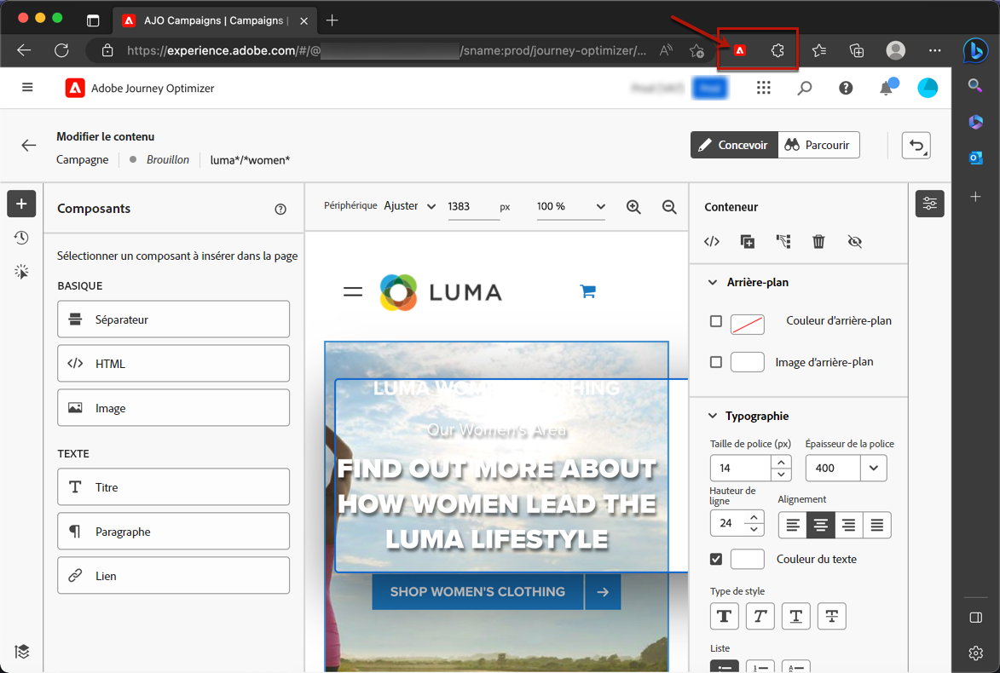

# Conditions préalables et mécanismes de sécurisation {#web-prerequisites}

Pour créer et accéder à des pages web dans l’interface utilisateur de [!DNL Journey Optimizer], remplissez les conditions préalables suivantes :

* Pour ajouter des modifications à votre site web, vous devez disposer d’une implémentation spécifique. [En savoir plus](#implementation-prerequisites).

* Pour accéder au concepteur web de [!DNL Journey Optimizer], une extension de navigateur Google Chrome spécifique doit être installée. [En savoir plus](#visual-authoring-prerequesites).

* Pour que l’expérience web soit correctement diffusée, veillez à définir les paramètres d’Adobe Experience Platform détaillés [ici](#delivery-prerequisites).

## Notes de mise en garde {#caution-notes-web}

* Dans [!DNL Journey Optimizer], vous ne pouvez actuellement créer des expériences web que dans des **campagnes**. [En savoir plus](../campaigns/create-campaign.md#configure).

* Les campagnes web de [!DNL Journey Optimizer] ciblent les nouveaux profils qui n’ont jamais été engagés sur d’autres canaux. Cela augmente le nombre total de profils engageables, ce qui peut avoir des implications de coût si le nombre contractuel de profils engageables que vous avez achetés est dépassé. Les mesures de licence de chaque package sont répertoriées dans la page [Description du produit Journey Optimizer](https://helpx.adobe.com/fr/legal/product-descriptions/adobe-journey-optimizer.html).{target="_blank"}

>[!AVAILABILITY]
>
>Pour l’instant, le canal web n’est pas disponible pour les organisations qui ont acheté les offres complémentaires **Healthcare Shield** et **Privacy and Security Shield**.

## Conditions préalables à l’implémentation {#implementation-prerequisites}

Actuellement, deux types d’implémentation sont pris en charge pour permettre la création et la diffusion de campagnes de canal web sur vos propriétés web :

* Côté client uniquement : pour ajouter des modifications à votre site web, vous devez implémenter le [SDK web d’Adobe Experience Platform](https://experienceleague.adobe.com/docs/platform-learn/implement-web-sdk/overview.html?lang=fr){target="_blank"} sur votre site web.

  >[!NOTE]
  >
  >Assurez-vous que la version de votre SDK Web AEP est 2.16 ou supérieure.

* Mode hybride : vous pouvez utiliser la variable [API du serveur Edge Network AEP](https://experienceleague.adobe.com/docs/experience-platform/edge-network-server-api/data-collection/interactive-data-collection.html?lang=fr){target="_blank"} pour demander une personnalisation côté serveur ; la réponse est fournie au SDK Web de Adobe Experience Platform pour effectuer le rendu des modifications côté client. En savoir plus dans Adobe Experience Platform [Documentation de l’API du serveur Edge Network](https://experienceleague.adobe.com/docs/experience-platform/edge-network-server-api/overview.html?lang=fr){target="_blank"}. Vous pouvez en savoir plus sur le mode hybride et consulter quelques exemples de mise en oeuvre dans [billet de blog](https://blog.developer.adobe.com/hybrid-personalization-in-the-adobe-experience-platform-web-sdk-6a1bb674bf41){target="_blank"}.

>[!NOTE]
>
>L’implémentation côté serveur uniquement n’est actuellement pas prise en charge.

<!--If the Adobe Experience Platform Web SDK is not yet implemented on the website, a message displays in the web designer suggesting that you install the Visual Editing Helper browser extension and implement the [Web SDK](https://experienceleague.adobe.com/docs/platform-learn/implement-web-sdk/overview.html){target="_blank"}.-->

## Conditions préalables à la création visuelle {#visual-authoring-prerequisites}

<!--In order to rapidly author and preview your web experiences, the Adobe Experience Cloud Visual Editing Helper browser extension for Google Chrome lets you load websites reliably within the Adobe [!DNL Journey Optimizer] web designer.-->

Pour pouvoir ouvrir, créer et prévisualiser vos pages web de manière fiable dans le concepteur web de [!DNL Journey Optimizer], vous devez disposer de l’extension de navigateur [Visual Editing Helper d’Adobe Experience Cloud ](https://chrome.google.com/webstore/detail/adobe-experience-cloud-vi/kgmjjkfjacffaebgpkpcllakjifppnca){target="_blank"} installée sur votre navigateur web.

>[!CAUTION]
>
>Google Chrome et Microsoft Edge sont actuellement les seuls navigateurs qui prennent en charge la création de pages web dans [!DNL Journey Optimizer].

### Installer l’extension Visual Editing Helper {#install-visual-editing-helper}

Pour télécharger et installer l’extension de navigateur Visual Editing Helper, suivez les étapes ci-dessous :

1. Ouvrez un nouvel onglet dans votre navigateur (Google Chrome ou Microsoft Edge).

1. Accédez au [Chrome Web Store de Google](https://chrome.google.com/webstore/category/extensions){target="_blank"}.

1. Si vous utilisez Microsoft Edge, sélectionnez **[!UICONTROL Autorisation les extensions d’autres magasins]** sur la bannière supérieure. Vous pourrez ainsi ajouter des extensions du Chrome Web Store à Microsoft Edge.

1. Recherchez l’extension de navigateur [Visual Editing Helper d’Adobe Experience Cloud](https://chrome.google.com/webstore/detail/adobe-experience-cloud-vi/kgmjjkfjacffaebgpkpcllakjifppnca){target="_blank"} et accédez-y.

1. Cliquez sur **[!UICONTROL Ajouter à Chrome]** > **[!UICONTROL Ajouter l’extension]**.

   >[!NOTE]
   >
   >Si vous utilisez Microsoft Edge, l’extension sera ajoutée à Edge même si le bouton indique **[!UICONTROL Ajouter à Chrome]**.

1. Assurez-vous que l’extension de navigateur Visual Editing Helper est correctement activée dans la barre d’outils de votre navigateur.

   

L’extension Visual Editing Helper d’Adobe Experience Cloud est désormais automatiquement activée lorsqu’un site web est ouvert dans le [concepteur web](edit-web-content.md#work-with-web-designer) [!DNL Journey Optimizer] pour optimiser la création.

L’extension ne dispose d’aucun paramètre conditionnel et gère automatiquement tous les paramètres, y compris les paramètres des cookies SameSite.

>[!NOTE]
>
>Certains sites web peuvent ne pas s’ouvrir de manière fiable dans le concepteur web [!DNL Journey Optimizer], et ce, pour l’une des raisons suivantes :
>
> * Le site web a des politiques de sécurité strictes.
> * Le site web se trouve dans un iframe.
> * Le site d’assurance qualité ou d’évaluation du client n’est pas disponible pour le monde extérieur (le site est interne).

### Résoudre les problèmes de chargement du site web {#troubleshooting}

Lors de l’utilisation du concepteur web d’Adobe [!DNL Journey Optimizer], si vous tentez de charger un site web et que ce chargement échoue, un message s’affiche vous suggérant d’installer l’[extension de navigateur Visual Editing Helper](#install-visual-editing-helper).

1. Assurez-vous que l’extension de navigateur Visual Editing Helper est correctement installée.

1. Si le site web se comporte toujours de manière inattendue, assurez-vous que les cookies tiers sont autorisés dans votre navigateur. Sinon, la page web ne peut pas être chargée dans le concepteur web [!DNL Journey Optimizer].

Pour les pages sous authentification, si le chargement de la page de connexion échoue ou si vous ne parvenez pas à vous connecter :

1. Essayez d’abord de vous connecter dans un nouvel onglet du navigateur et accédez à la page souhaitée, puis copiez l’URL et essayez de l’ouvrir dans le concepteur web de [!DNL Journey Optimizer].

2. Si vous ne parvenez toujours pas à charger votre site web dans le concepteur web de [!DNL Journey Optimizer], contactez l’assistance clientèle d’Adobe pour signaler le problème, en veillant à spécifier l’URL défaillante.

## Conditions préalables à la diffusion {#delivery-prerequisites}

Pour que l’expérience web soit correctement diffusée, les paramètres suivants doivent être définis :

* Dans la [Collecte de données Adobe Experience Platform](https://experienceleague.adobe.com/docs/experience-platform/edge/datastreams/overview.html?lang=fr){target="_blank"}, assurez-vous qu’un train de données est défini, de telle sorte que sous le service **[!UICONTROL Adobe Experience Platform]**, l’option **[!UICONTROL Adobe Journey Optimizer]** soit activée.

  Cela permet de s’assurer que les événements entrants Journey Optimizer sont correctement gérés par Adobe Experience Platform Edge. [En savoir plus](https://experienceleague.adobe.com/docs/experience-platform/edge/datastreams/configure.html?lang=fr){target="_blank"}.

  

* Dans [Adobe Experience Platform](https://experienceleague.adobe.com/docs/experience-platform/profile/home.html?lang=fr){target="_blank"}, assurez-vous que vous disposez d’une stratégie de fusion avec la variable **[!UICONTROL Stratégie de fusion Active-On-Edge]** activée. Pour ce faire, sélectionnez une politique sous le menu Experience Platform **[!UICONTROL Client]** > **[!UICONTROL Profils]** > **[!UICONTROL Politiques de fusion]**. [En savoir plus](https://experienceleague.adobe.com/docs/experience-platform/profile/merge-policies/ui-guide.html?lang=fr#configure){target="_blank"}

  Cette politique de fusion est utilisée par les canaux entrants [!DNL Journey Optimizer] pour activer et publier correctement les campagnes entrantes sur Edge. [En savoir plus](https://experienceleague.adobe.com/docs/experience-platform/profile/merge-policies/ui-guide.html?lang=fr){target="_blank"}.

  

* Pour résoudre les problèmes liés à la diffusion d’expériences web Journey Optimizer, vous pouvez utiliser la variable **Diffusion Edge** Afficher dans **Adobe Experience Platform Assurance**. Ce module externe vous permet d’examiner en détail les appels de requête, de vérifier si les appels Edge attendus se produisent comme prévu et d’examiner les données de profil, notamment les cartes d’identité, les appartenances aux segments et les paramètres de consentement. En outre, vous pouvez consulter les activités pour lesquelles la requête a rempli les critères et identifier celles pour lesquelles elle n’a pas rempli les critères.

  En utilisant la variable **Diffusion Edge** vous aide à obtenir les informations nécessaires pour comprendre et résoudre efficacement les problèmes liés à vos implémentations entrantes.

  [En savoir plus sur la vue Edge Delivery](https://experienceleague.adobe.com/en/docs/experience-platform/assurance/view/edge-delivery)

## Conditions préalables à l’expérience de contenu {#experiment-prerequisites}

Pour activer les expériences de contenu pour le canal web, vous devez vous assurer que le [jeu de données](../data/get-started-datasets.md) utilisé dans le [train de données](https://experienceleague.adobe.com/docs/experience-platform/datastreams/overview.html?lang=fr){target="_blank"} de votre implémentation web est également inclus dans la configuration des rapports.

En d’autres termes, lors de la configuration des rapports d’expérience, si vous ajoutez un jeu de données qui n’est pas présent dans votre train de données web, les données web ne s’afficheront pas dans les rapports d’expérience de contenu.

Découvrez comment ajouter des jeux de données pour les rapports d’expérience de contenu dans [cette section](../campaigns/reporting-configuration.md#add-datasets).

>[!NOTE]
>
>Le jeu de données est utilisé en lecture seule par le système de création de rapports de [!DNL Journey Optimizer] et n’affecte pas la collecte ni l’ingestion de données.

Si vous **not** à l’aide de la prédéfinie suivante : [groupes de champs](https://experienceleague.adobe.com/docs/experience-platform/xdm/tutorials/create-schema-ui.html?lang=fr#field-group){target="_blank"} pour votre schéma de jeu de données : `AEP Web SDK ExperienceEvent` et `Consumer Experience Event` (comme défini dans [cette page](https://experienceleague.adobe.com/docs/platform-learn/implement-web-sdk/initial-configuration/configure-schemas.html?lang=fr#add-field-groups){target="_blank"}), veillez à ajouter les groupes de champs suivants : `Experience Event - Proposition Interactions`, `Application Details`, `Commerce Details`, et `Web Details`. Ils participent à la création de rapports d’expérience de contenu de [!DNL Journey Optimizer], car ils effectuent le suivi des expériences et des traitements auxquels chaque profil participe.

>[!NOTE]
>
>L’ajout de ces groupes de champs n’a aucune incidence sur la collecte de données standard. Seules les pages où une expérience est en cours d’exécution sont concernées. Les autres éléments de suivi restent inchangés.

## Domaines de marque pour les ressources {#branded-domains-for-assets}

Lors de la création d’expériences web, si vous ajoutez du contenu provenant de la bibliothèque [Adobe Experience Manager Assets](../content-management/assets.md), vous devez configurer le sous-domaine qui sera utilisé pour publier ce contenu. [En savoir plus](web-delegated-subdomains.md)
