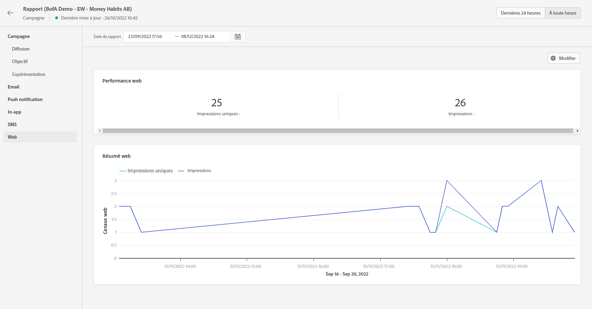

# Rapport web {#web-report}

Le rapport Web est disponible dans le rapport Campagne .

>[!NOTE]
>
>La fonctionnalité de canal web est actuellement disponible en version bêta pour sélectionner uniquement les utilisateurs.

La page Rapport   de la campagne s&#39;affiche avec les onglets suivants :

* [Campagne](../reports/campaign-global-report.md#campaign-live)
* [E-mail](../reports/campaign-global-report.md#email-live)
* [Push](../reports/campaign-global-report.md#push-live)
* [SMS](../reports/campaign-global-report.md#sms-live)
* [Web](#web-tab)

Le **[!UICONTROL Rapport global]** de campagne est divisé en différents widgets présentant le succès et les erreurs de votre campagne. Chaque widget peut être redimensionné et supprimé si nécessaire. Pour plus d&#39;informations à ce propos, consultez cette [section](../reports/global-report.md#modify-dashboard).

Pour obtenir la liste détaillée de chaque mesure disponible dans Adobe Journey Optimizer, reportez-vous à [cette page](../reports/global-report.md#list-of-components-global.md).

## Onglet Web {#web-tab}

Le **[!UICONTROL Performances web]** Les indicateurs de performance clés détaillent les informations principales relatives à l’engagement de vos visiteurs avec vos expériences web, telles que :

* **[!UICONTROL Impressions uniques]**: nombre d’utilisateurs uniques auxquels l’expérience web a été diffusée.

* **[!UICONTROL Impressions]**: nombre total d’expériences web diffusées à tous les utilisateurs.

Le **[!UICONTROL Résumé web]** Le graphique montre l’évolution de vos expériences web (impressions et impressions uniques) pour la période concernée.
