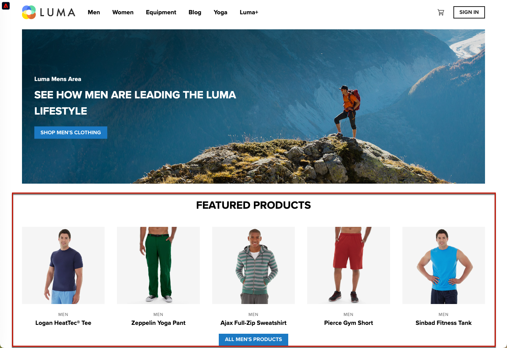
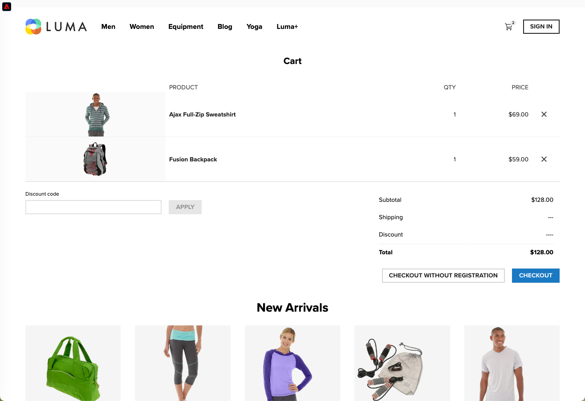

# Implémentation d’applications sur une seule page (SPA) {#web-spa-implementation}

Adobe Experience Platform Web SDK fournit des fonctionnalités riches qui permettent à votre entreprise d’exécuter de la personnalisation sur des technologies côté client de nouvelle génération, telles que les applications d’une seule page (SPA).

Les sites web traditionnels fonctionnent sur des modèles de navigation « page à page », également appelés applications multi-pages, où les conceptions de site web sont étroitement couplées à des URL et où les transitions d’une page web à une autre nécessitent un chargement de page.

Les applications web modernes, telles que les applications d’une seule page (SPA), ont plutôt adopté un modèle qui propulse l’utilisation rapide du rendu de l’interface utilisateur du navigateur, qui est souvent indépendant des rechargements de page. Ces expériences peuvent être déclenchées par des interactions client, telles que des défilements, des clics et des mouvements de curseur. À mesure que les paradigmes du web moderne ont évolué, la pertinence des événements génériques traditionnels, tels que le chargement d’une page, pour déployer la personnalisation et l’expérimentation ne fonctionne plus.


## Avantages de l’utilisation de Web SDK pour les SPA {#web-spa-benefits}

Voici quelques avantages de l’utilisation de Web SDK pour vos applications monopages :

* Capacité à mettre en cache toutes les offres au chargement de la page afin de passer de plusieurs appels serveur à un seul appel serveur.
* Améliorez considérablement l’expérience utilisateur sur votre site, car les offres sont affichées immédiatement via le cache, sans le temps de retard introduit par les appels au serveur traditionnels.
* La configuration ponctuelle des développeurs permet aux spécialistes du marketing de créer et d’exécuter des activités de personnalisation et d’expérimentation via l’éditeur visuel web de Adobe Journey Optimizer sur votre SPA.

## Vues XDM et applications d’une seule page {#web-spa-xdm}

L’éditeur web de Journey Optimizer tire parti d’un concept appelé _vues_.

Les vues sont un groupe logique d’éléments visuels qui, ensemble, constituent une expérience SPA. Une application d’une seule page peut donc être considérée comme une transition par vues, au lieu d’URL, en fonction des interactions utilisateur. Une vue peut généralement représenter l’ensemble d’un site, une seule page ou des éléments visuels regroupés au sein d’une page.

Pour mieux expliquer les vues, l’exemple suivant utilise un hypothétique site d’e-commerce en ligne.

* Après avoir accédé au site d’accueil, une image de marque fait la promotion des collections saisonnières ainsi que des différents catalogues de produits disponibles sur le site. Dans ce cas, une vue peut être définie pour l’ensemble de l’écran d’accueil. Cette vision pourrait simplement s&#39;appeler « maison ».

  

* À mesure que le client s&#39;intéresse davantage aux produits que l&#39;entreprise vend, il décide de cliquer sur le lien **Hommes**. Tout comme la page d’accueil, l’intégralité de la page **Hommes** peut être définie comme une vue. Cette vue pourrait être nommée « hommes ».

  

* Étant donné qu’une vue peut être définie comme un site entier ou un groupe d’éléments visuels sur un site, les quatre produits affichés sur le site de produits peuvent être regroupés et considérés comme une vue. Cette vue peut être nommée « produits ».

  

* Lorsque le client décide de cliquer sur le bouton **TOUS LES PRODUITS POUR HOMMES** pour explorer d’autres produits sur le site, l’URL du site web ne change pas dans ce cas, mais une vue peut être créée ici pour représenter uniquement la deuxième ligne de produits affichés. Le nom de la vue peut être « products-page-2 ».

* Le client décide d&#39;acheter quelques produits sur le site et passe à l&#39;écran de passage en caisse. L’écran du panier lui-même peut être associé à une vue nommée « panier ». Vous pouvez également utiliser une vue différente dans l’écran de passage en caisse pour gérer les produits recommandés ci-dessous.

  

Le concept de points de vue peut être étendu bien au-delà de cela. Il ne s’agit que de quelques exemples de vues pouvant être définies sur un site.

## Implémentation des vues XDM {#implement-xdm-views}

Les vues XDM peuvent être exploitées dans Adobe Journey Optimizer pour permettre aux marketeurs d’exécuter des campagnes de personnalisation et d’expérimentation web sur des SPA, via l’éditeur visuel web de Journey Optimizer.

Pour ce faire, les étapes suivantes doivent être effectuées afin de terminer une configuration de développeur ponctuelle :

1. Installez [Adobe Experience Platform Web SDK](https://experienceleague.adobe.com/docs/experience-platform/edge/fundamentals/installing-the-sdk.html?lang=fr){target="_blank"} et vérifiez la page [Conditions préalables du canal web](web-prerequisites.md).

2. Déterminez toutes les vues XDM de votre application monopage que vous souhaitez personnaliser.

3. Après avoir défini les vues XDM, pour diffuser du contenu vers ces vues, vous devez implémenter la fonction `sendEvent()` avec `renderDecisions` défini sur `true` et la vue XDM correspondante dans votre application d’une seule page. La vue XDM doit être transmise dans `xdm.web.webPageDetails.viewName`. Cette étape permet aux marketeurs de découvrir ces vues dans l’éditeur web de Journey Optimizer et d’y appliquer des modifications de contenu :

```js
 alloy("sendEvent", {
  "renderDecisions": true,
  "xdm": {
   "web": {
    "webPageDetails": {
    "viewName":"home"
   }
  }
 }
});
```

>[!NOTE]
>
>Lors du premier appel `sendEvent()`, toutes les vues XDM qui doivent être rendues à l’utilisateur final sont récupérées et mises en cache. Les appels `sendEvent()` suivants avec des vues XDM transmises sont lus à partir du cache et rendus sans appel au serveur.

## Exemples de fonctions `sendEvent()`

Cette section présente deux exemples montrant comment appeler la fonction `sendEvent()` dans React pour une hypothétique SPA d’e-commerce.

### Exemple 1 : page d’accueil du test A/B {#web-spa-sample-1}

L’équipe marketing souhaite exécuter des tests A/B sur l’ensemble de la page d’accueil.


Pour exécuter des tests A/B sur l’ensemble du site d’accueil, `sendEvent()` devez être appelé avec le `viewName` XDM défini sur `home` :

```js
function onViewChange() {

  var viewName = window.location.hash; // or use window.location.pathName if router works on path and not hash

  viewName = viewName || 'home'; // view name cannot be empty

  // Sanitize viewName to get rid of any trailing symbols derived from URL

  if (viewName.startsWith('#') || viewName.startsWith('/')) {
    viewName = viewName.substr(1);
  }

  alloy("sendEvent", {
    "renderDecisions": true,

    "xdm": {
      "web": {
        "webPageDetails": {
          "viewName":"home"
        }
      }
    }
  });
}

// react router v4

const history = syncHistoryWithStore(createBrowserHistory(), store);

history.listen(onViewChange);

// react router v3

<Router history={hashHistory} onUpdate={onViewChange} >
```

### Exemple 2 : produits personnalisés {#web-spa-sample-2}

L’équipe marketing souhaite personnaliser la deuxième ligne de produits en changeant la couleur de l’étiquette de prix en rouge lorsqu’un utilisateur clique pour voir tous les produits pour les hommes.


```js
function onViewChange(viewName) {

    alloy("sendEvent", {
        "renderDecisions": true,
        "xdm": {
            "web": {
                "webPageDetails": {
                    "viewName": viewName
                }
            }
        }
    });
}

class Products extends Component {

    render() {
        return (

            <
            button type = "button"
            onClick = {
                this.handleLoadMoreClicked
            } > All Men 's Products</button>
        );
    }

    handleLoadMoreClicked() {
        var page = this.state.page + 1; // assuming page number is derived from component's state
        this.setState({
            page: page
        });
        onViewChange('PRODUCTS-PAGE-' + page);
    }
}
```
