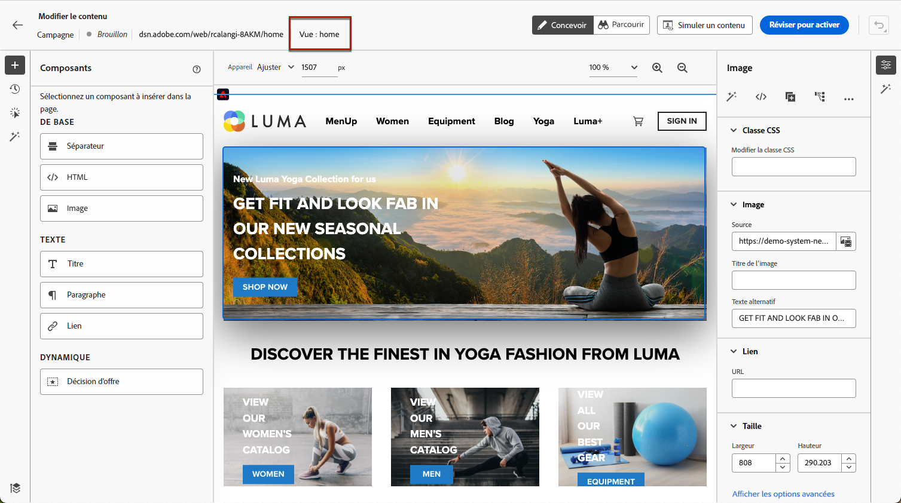
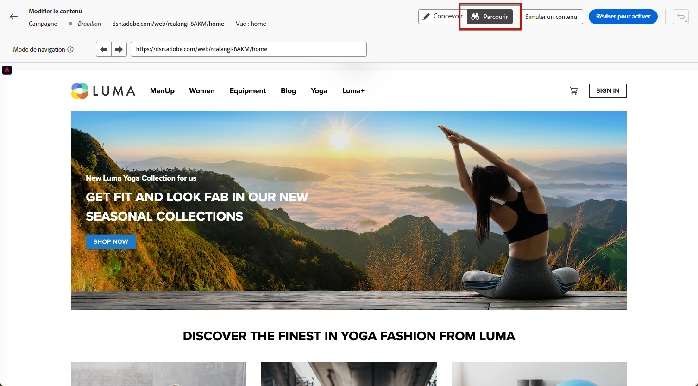
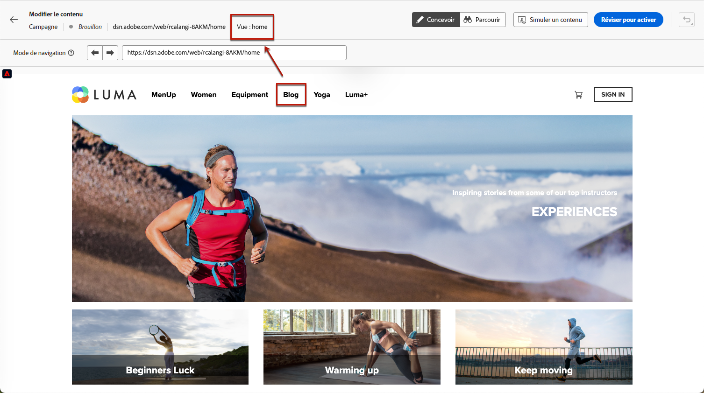
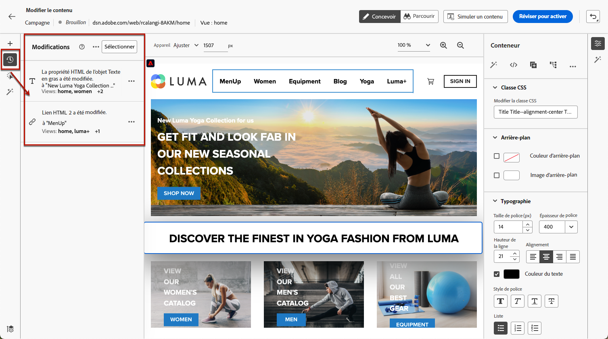
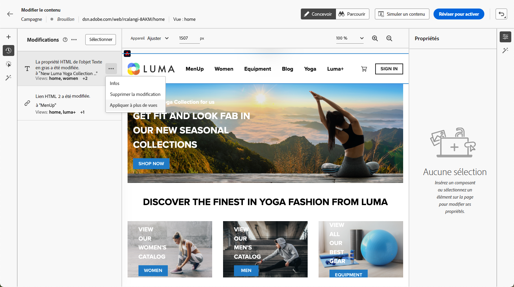
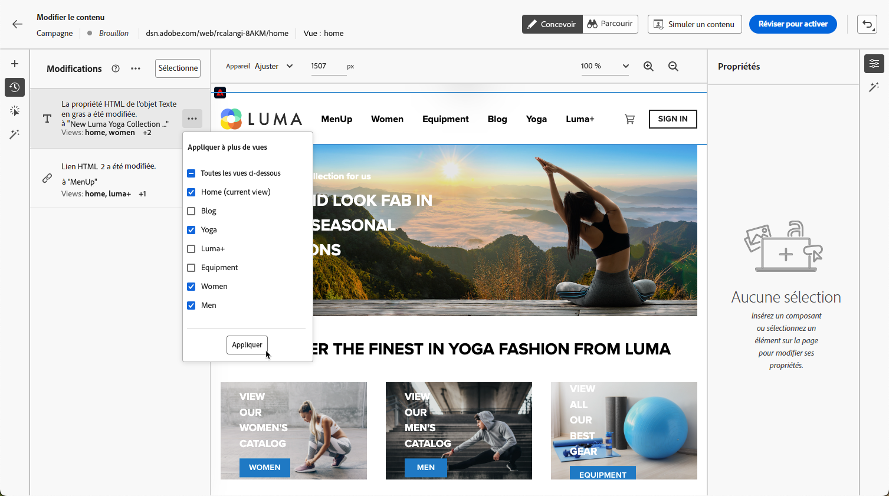
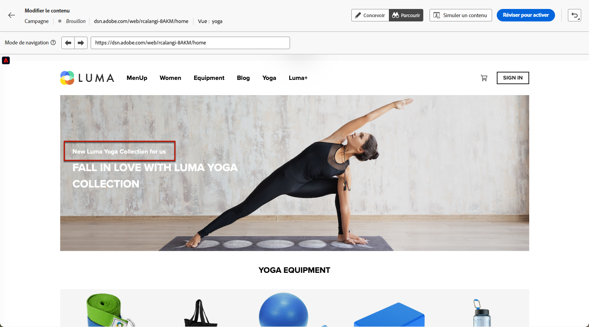

# Créer des applications monopage {#web-author-spas}

## À propos des vues {#about-views}

>[!CONTEXTUALHELP]
>id="ajo_web_designer_modifications_views"
>title="Appliquer les modifications aux vues sélectionnées"
>abstract="Les modifications seront appliquées uniquement pour les vues sélectionnées. Pour découvrir les vues, utilisez le mode **Parcourir** et accédez aux vues. Vous ne trouvez pas la vue que vous recherchez ?"
>additional-url="https://experienceleague.adobe.com/docs/platform-learn/implement-web-sdk/overview.html?lang=fr" text="En savoir plus"

Les **applications monopages** peuvent désormais être créées dans l’éditeur visuel du concepteur web. Vous pouvez ainsi sélectionner les **vues** spécifiques auxquelles vous souhaitez appliquer vos modifications de page web.

[Découvrez comment créer des applications à une seule page dans cette vidéo](#video)

Une vue peut être définie pour un site entier ou un groupe d’éléments visuels sur un site, tels que la page d’accueil, l’ensemble du site de produits ou les préférences de livraison, encadrés sur toutes les pages de passage en caisse.

Une configuration unique du développeur est nécessaire pour définir les vues dans l’implémentation du SDK web Adobe Experience Platform. Vous pouvez ainsi créer et exécuter des campagnes web Adobe Journey Optimizer sur les applications à une seule page.

## Définition des vues dans l’implémentation du SDK web {#define-views}

Les vues XDM peuvent être exploitées dans Adobe [!DNL Journey Optimizer] pour permettre aux spécialistes du marketing d’exécuter des campagnes de personnalisation et d’expérimentation web sur une application à une seule page via l’éditeur visuel web. [En savoir plus](https://experienceleague.adobe.com/docs/experience-platform/edge/personalization/ajo/web-spa-implementation.html?lang=fr){target="_blank"}

Pour créer des vues dans l’interface utilisateur de [!DNL Journey Optimizer] et y accéder, suivez les étapes répertoriées dans [cette section](https://experienceleague.adobe.com/docs/experience-platform/edge/personalization/ajo/web-spa-implementation.html?lang=fr#implement-xdm-views){target="_blank"}.

## Découvrez les vues dans le concepteur web {#discover-views}

Une fois la configuration des applications à une seule page effectuée dans l’implémentation du SDK web d’Adobe Experience Platform, vous devez parcourir toutes les vues de votre site Web auxquelles vous souhaitez appliquer des modifications. Suivez les étapes ci-dessous.

1. [Créez un parcours web ou une campagne](create-web.md) et accédez au [concepteur web](web-visual-editor.md).

   La vue dans laquelle vous vous trouvez actuellement s’affiche en haut à gauche.

   

1. Basculez vers le mode **[!UICONTROL Parcourir]**. [En savoir plus](web-visual-editor.md#browse-mode)

   

1. Naviguez entre les différentes pages du site Web pour toutes les découvrir. Le nom de la vue affiché en haut change lorsque vous accédez à une autre page.

   

## Appliquer des modifications à d’autres vues {#apply-modifications-views}

Une fois que vous avez ajouté une modification alors que vous vous trouvez dans une vue spécifique, vous pouvez l’appliquer à d’autres vues sélectionnées. Suivez les étapes ci-dessous.

>[!CAUTION]
>
>Si vous n’avez pas découvert de vues à l’aide du mode **[!UICONTROL Parcourir]**, vous ne pourrez pas les sélectionner pour appliquer vos modifications. [En savoir plus](#discover-views)

1. Sélectionnez l’icône **[!UICONTROL Modifications]** pour afficher le volet correspondant à gauche.

   

1. Sélectionnez une modification et cliquez sur le bouton **[!UICONTROL Autres actions]** en regard. Sélectionnez **[!UICONTROL Appliquer à d’autres vues]**.

   

1. Sélectionnez les vues auxquelles vous souhaitez appliquer vos modifications.

   

1. Cliquez sur **[!UICONTROL Appliquer]**.

1. Passez au mode **[!UICONTROL Parcourir]** pour vérifier que les modifications sont appliquées aux pages souhaitées.

   

## Vidéo pratique{#video}

Cette vidéo explique comment :

* Découvrir les vues SPA en mode **[!UICONTROL Parcourir]**
* Effectuer une création dans la vue actuelle
* Appliquer des modifications de site Web à plusieurs vues ou à toutes les vues découvertes
* Effectuer des actions en bloc sur les modifications

>[!VIDEO](https://video.tv.adobe.com/v/3424536/?quality=12&learn=on)
