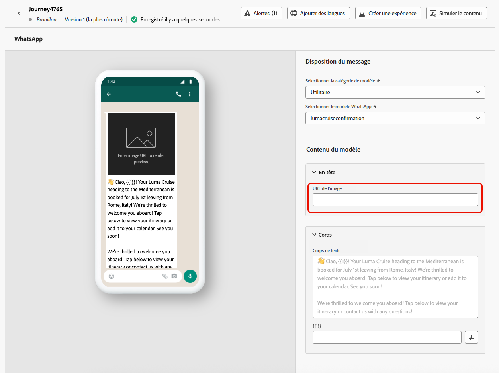

# Créer un message WhatsApp {#create-whatsapp}

>[!BEGINSHADEBOX]

**Table des matières**

* [Commencer avec les messages WhatsApp](get-started-whatsapp.md)
* [Prise en main de la configuration de WhatsApp](whatsapp-configuration.md)
* **[Créer un message WhatsApp](create-whatsapp.md)**
* [Vérifier et envoyer des messages WhatsApp](send-whatsapp.md)

>[!ENDSHADEBOX]

Avec Adobe Journey Optimizer, vous pouvez concevoir et envoyer des messages attrayants sur WhatsApp. Ajoutez simplement une action WhatsApp à votre parcours ou campagne et concevez le contenu de votre message comme décrit ci-dessous. Adobe Journey Optimizer vous permet également de tester vos messages WhatsApp avant de les envoyer, assurant ainsi un rendu parfait, une personnalisation précise et une configuration correcte de tous les paramètres.

Notez que seuls les éléments de messages sortants sont pris en charge dans Journey Optimizer.

+++ En savoir plus sur les éléments de message pris en charge et les appels à l’action

Les types de messages supportés dans WhatsApp sont les suivants :

| Fonctionnalité de message | Description |
|-|-|
| En-têtes | Texte facultatif qui apparaît au-dessus du corps de votre message. |
| Texte | Prend en charge le contenu dynamique par le biais de paramètres. |
| Images (JPEG, PNG) | Doit être au format RGB ou RGBA 8 bits et d’une taille inférieure à 5 Mo. |
| Vidéos | Doit être 3GPP ou MP4, de moins de 16 Mo, et hébergé via une URL. |
| Audio | Disponible uniquement pour les messages de réponse. Doit être au format AAC, AMR, MP3, MP4 audio ou OGG, hébergé sur une URL et de moins de 16 Mo. |
| Documents | Doit être inférieur à 100 Mo, hébergé sur une URL et dans l’un des formats suivants : .txt, .xls/.xlsx, .doc/.docx, .ppt/.pptx ou .pdf. |
| Corps de texte | Prend en charge le contenu dynamique par le biais de paramètres. |
| Texte du pied de page | Prend en charge le contenu dynamique par le biais de paramètres. |

L&#39;option call-to-action suivante est disponible pour vos messages WhatsApp :

| Appel à l’action | Description |
|-|-|
| Visiter le site web | Un seul bouton est autorisé, avec les paramètres de variable inclus. |

+++

## Ajouter un message WhatsApp {#create-whatsapp-journey-campaign}

Parcourez les onglets ci-dessous pour savoir comment ajouter un message WhatsApp dans une campagne ou un parcours.

>[!BEGINTABS]

>[!TAB Ajouter un message WhatsApp à un Parcours ]

1. Ouvrez votre parcours, puis effectuez un glisser-déposer d’une **activité WhatsApp** depuis la section **Actions** de la palette.

   

1. Fournissez des informations de base sur votre message (libellé, description, catégorie), puis choisissez la configuration de message à utiliser.

   Pour plus d’informations sur la configuration de votre parcours, consultez [cette page](../building-journeys/journey-gs.md).

   Par défaut, le champ de **[!UICONTROL configuration]** est prérempli avec la dernière configuration utilisée par l’utilisateur ou l’utilisatrice pour ce canal.

Vous pouvez maintenant commencer à concevoir le contenu de votre message WhatsApp à partir du bouton **[!UICONTROL Modifier le contenu]**, comme décrit ci-dessous.

>[!TAB Ajouter un message WhatsApp à une campagne]

1. Accédez au menu **[!UICONTROL Campagnes]**, puis cliquez sur **[!UICONTROL Créer une campagne]**.

1. Sélectionnez le type de campagne **Planifié - Marketing**.

1. Dans la section **[!UICONTROL Propriétés]**, modifiez le **[!UICONTROL Titre]** et la **[!UICONTROL Description]** de votre campagne.

1. Cliquez sur le bouton **[!UICONTROL Sélectionner une audience]** pour définir l’audience à cibler à partir de la liste des audiences Adobe Experience Platform disponibles. [En savoir plus](../audience/about-audiences.md).

1. Dans le champ **[!UICONTROL Espace de noms d’identité]**, choisissez l’espace de noms à utiliser pour identifier les personnes à partir de l’audience sélectionnée. [En savoir plus](../event/about-creating.md#select-the-namespace).

1. Dans la section **[!UICONTROL Actions]**, choisissez **[!UICONTROL WhatsApp]** et sélectionnez ou créez une configuration.

   En savoir plus sur la configuration WhatsApp sur [cette page](whatsapp-configuration.md).

   

1. Cliquez sur **[!UICONTROL Créer une expérience]** pour commencer à configurer votre expérience de contenu et créer des traitements afin de mesurer leurs performances et d’identifier la meilleure option pour votre audience cible. [En savoir plus](../content-management/content-experiment.md).

1. Dans la section **[!UICONTROL Tracking des actions]**, indiquez si vous souhaitez effectuer le tracking des clics sur les liens de votre message WhatsApp.

1. Les campagnes sont conçues pour être exécutées à une date spécifique ou à une fréquence récurrente. Découvrez comment configurer le **[!UICONTROL Planning]** de votre campagne dans [cette section](../campaigns/create-campaign.md#schedule).

1. Dans le menu **[!UICONTROL Déclencheurs d&#39;action]**, choisissez le **[!UICONTROL Fréquence]** de votre message WhatsApp :

   * Une fois
   * Quotidien
   * Hebdomadaire
   * Mois

Vous pouvez maintenant commencer à concevoir le contenu de votre message WhatsApp à partir du bouton **[!UICONTROL Modifier le contenu]**, comme décrit ci-dessous.

>[!ENDTABS]

## Définir votre contenu WhatsApp{#whatsapp-content}

>[!BEGINSHADEBOX]

Avant de concevoir votre message WhatsApp dans Journey Optimizer, vous devez d&#39;abord créer et concevoir votre modèle dans Meta. [En savoir plus](https://www.facebook.com/business/help/2055875911147364?id=2129163877102343)

Notez que votre modèle WhatsApp doit d&#39;abord être approuvé par Meta avant de l&#39;utiliser dans Journey Optimizer. Ce processus prend généralement quelques heures, mais peut prendre jusqu’à 24 heures. [En savoir plus](https://developers.facebook.com/docs/whatsapp/message-templates/guidelines/#approval-process)

>[!ENDSHADEBOX]

1. Dans l&#39;écran de configuration du parcours ou de la campagne, cliquez sur le bouton **[!UICONTROL Modifier le contenu]** pour configurer le contenu du message WhatsApp.

<!--
1. Select **[!UICONTROL Template message]**.
-->

1. Choisissez votre **catégorie de modèles** :

   * Marketing
   * Utilitaire
   * Authentification

   [En savoir plus sur les catégories de modèles](https://developers.facebook.com/docs/whatsapp/updates-to-pricing/new-template-guidelines/#template-category-guidelines)

   

1. Dans la liste déroulante **Modèle WhatsApp**, sélectionnez le modèle créé précédemment et conçu dans Meta.

   [En savoir plus sur la création de vos modèles Whatsapp](https://www.facebook.com/business/help/2055875911147364?id=2129163877102343)

   

1. Utilisez l’éditeur de personnalisation pour personnaliser votre modèle. Vous pouvez utiliser n’importe quel attribut, comme le nom du profil ou la ville par exemple.

   Parcourez la page suivante pour en savoir plus sur la [personnalisation](../personalization/personalize.md).

   

1. Utilisez le bouton **[!UICONTROL Simuler du contenu]** pour prévisualiser le contenu de votre message WhatsApp, les URL raccourcies et le contenu personnalisé. [En savoir plus](send-whatsapp.md)

Une fois que vous avez effectué vos tests et validé le contenu, vous pouvez envoyer votre message WhatsApp à votre audience. Ces étapes sont détaillées sur [cette page](send-whatsapp.md)

<!--
* **[!UICONTROL Template message]**: Predefined message imported from Meta into Journey Optimizer. These are intended for sending notifications, alerts, or updates to your customers.

* **[!UICONTROL Response message]**: Message created in Journey Optimizer and sent in reply to customer queries or interactions.

>[!BEGINTABS]

>[!TAB Template message]

1. From the journey or campaign configuration screen, click the **[!UICONTROL Edit content]** button to configure the WhatsApp message content.

1. Select **[!UICONTROL Template message]**.

1. Choose your Template category. [Learn more](https://developers.facebook.com/docs/WhatsApp/updates-to-pricing/new-template-guidelines/)

1. From the **WhatsApp template** drop-down, select your previously created template designed in Meta.

1. Use the personalization editor to define content, add personalization and dynamic content. You can use any attribute, such as the profile name or city for example. You can also define conditional rules. Browse to the following pages to learn more about [personalization](../personalization/personalize.md) and [dynamic content](../personalization/get-started-dynamic-content.md) in the personalization editor.

1. Use the **[!UICONTROL Simulate content]** button to preview your WhatsApp message content, shortened URLs, and personalized content. [Learn more](send-whatsapp.md)

Once you have performed your tests and validated the content, you can send your WhatsApp message to your audience. These steps are detailed on [this page](send-whatsapp.md)

>[!TAB Response message]

1. From the journey or campaign configuration screen, click the **[!UICONTROL Edit content]** button to configure the WhatsApp message content.

1. Select **[!UICONTROL Response message]**.

1. Enter your text in the **[!UICONTROL Body]** field.

1. Use the personalization editor to define content, add personalization and dynamic content. You can use any attribute, such as the profile name or city for example. You can also define conditional rules. Browse to the following pages to learn more about [personalization](../personalization/personalize.md) and [dynamic content](../personalization/get-started-dynamic-content.md) in the personalization editor.

1. Use the **[!UICONTROL Simulate content]** button to preview your WhatsApp message content, shortened URLs, and personalized content. [Learn more](send-whatsapp.md)

Once you have performed your tests and validated the content, you can send your WhatsApp message to your audience. These steps are detailed on [this page](send-whatsapp.md)

>[!ENDTABS]
-->
