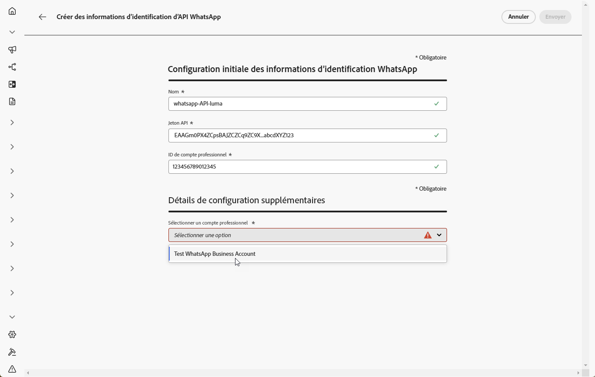

# Commencer la configuration WhatsApp {#whatsapp-config}

Avant d’envoyer un message WhatsApp, vous devez configurer votre environnement Adobe Journey Optimizer et l’associer à votre compte WhatsApp. Pour ce faire, procédez comme suit :

1. [Créez vos informations d’identification d’API WhatsApp.](#WhatsApp-credentials)
1. [Créer vos webhooks WhatsApp](#WhatsApp-webhook)
1. [Créez une configuration de WhatsApp.](#WhatsApp-configuration)

Ces étapes doivent être exécutées par un [Administrateur ou une Administratrice système](../start/path/administrator.md) Adobe Journey Optimizer.

## Créer des informations d’identification d’API WhatsApp {#whatsapp-credentials}

1. Dans le rail de gauche, accédez à **[!UICONTROL Administration]** `>` **[!UICONTROL Canaux]** et sélectionnez le menu **[!UICONTROL Informations d’identification de l’API]**. Cliquez sur le bouton **[!UICONTROL Créer des informations d’identification de l’API]**.

1. Configurez vos informations d’identification dʼAPI comme indiqué ci-dessous :

   * **Jeton API** : saisissez votre jeton API. Pour en savoir plus, consultez la [documentation Meta](https://developers.facebook.com/blog/post/2022/12/05/auth-tokens/).
   * **ID de compte professionnel** : saisissez le numéro unique associé à votre porfolio professionnel. Pour en savoir plus, consultez la [documentation Meta](https://www.facebook.com/business/help/1181250022022158?id=180505742745347).

   

1. Cliquez sur **[!UICONTROL Continuer]**.

1. Choisissez le **compte professionnel WhatsApp** que vous souhaitez connecter à vos informations d’identification d’API WhatsApp.

   

1. Sélectionnez le **nom de l’expéditeur ou de l’expéditrice** utilisé pour envoyer vos messages WhatsApp.

1. Les paramètres de votre numéro de téléphone sont automatiquement renseignés :

   * **Évaluation de la qualité** : reflète les commentaires de la clientèle sur les messages envoyés au cours des dernières 24 heures.
      * Vert : haute qualité
      * Jaune : qualité moyenne
      * Rouge : faible qualité

     En savoir plus sur l’[évaluation de la qualité](https://www.facebook.com/business/help/766346674749731#).

   * **Débit** : indique la vitesse à laquelle votre numéro de téléphone peut envoyer des messages.

1. Cliquez sur **[!UICONTROL Envoyer]** lorsque vous avez terminé la configuration de vos informations d’identification d’API.

Après avoir créé et configuré vos informations d’identification d’API, vous devez créer votre webhook pour les messages WhatsApp. [En savoir plus](#whatsapp-webhook)

## Créer un webhook {#WhatsApp-webhook}

>[!CONTEXTUALHELP]
>id="ajo_admin_whatsapp_webhook_inbound_keyword_category"
>title="Catégorie de mots-clés entrants"
>abstract="<b>Opt-in</b> : envoie votre réponse automatique définie lorsqu’un utilisateur ou une utilisatrice s’abonne.  <b>Opt-out</b> : envoie votre réponse automatique définie lorsqu’un utilisateur ou une utilisatrice se désabonne.  <b>Aide</b> : envoie votre réponse automatique définie lorsqu’un utilisateur ou une utilisatrice demande de l’aide ou de l’assistance.  <b>Par défaut</b> : envoie votre réponse automatique de secours lorsqu’aucun mot-clé ne correspond."

>[!CONTEXTUALHELP]
>id="ajo_admin_whatsapp_webhook_inbound_keyword"
>title="Saisir vos mots-clés"
>abstract="Vous pouvez définir des mots-clés pour déclencher des réponses automatiques spécifiques en fonction du texte des utilisateurs et utilisatrices. Les mots-clés ne sont pas sensibles à la casse ; par exemple, arrêter et ARRÊTER sont traités de la même manière."

>[!CONTEXTUALHELP]
>id="ajo_admin_whatsapp_webhook_webhook_url"
>title="URL de rappel"
>abstract="La demande de validation et les notifications webhook pour cet objet sont envoyées à l’URL spécifiée."

>[!CONTEXTUALHELP]
>id="ajo_admin_whatsapp_webhook_verify_token"
>title="Jeton de vérification"
>abstract="Jeton renvoyé par Meta pour confirmer et vérifier l’URL de rappel pendant le processus de vérification."

>[!NOTE]
>
>Sans des mots-clés d’opt-in ou d’opt-out spécifiés, les messages de consentement standard ne sont pas activés.

Une fois vos identifiants d&#39;API WhatsApp créés avec succès, vous pouvez configurer les Webhooks pour :

* **Capture des réponses entrantes** pour la gestion du consentement d’opt-in et d’opt-out
* **Recevoir les rapports de diffusion** tels que les accusés de réception de lecture (le cas échéant) et le statut de diffusion des messages
* **Activer le suivi des événements** pour les analyses et les rapports dans les jeux de données Adobe Experience Platform

Les Webhooks agissent comme le pont de communication entre la plateforme commerciale WhatsApp de Meta et Adobe Journey Optimizer, ce qui vous permet de recevoir des notifications en temps réel sur les événements de message et les interactions utilisateur.

1. Dans le rail de gauche, accédez à **[!UICONTROL Administration]** `>` **[!UICONTROL Canaux]**, sélectionnez le menu **[!UICONTROL Webhooks WhatsApp]** dans **[!UICONTROL Paramètres WhatsApp]**, puis cliquez sur le bouton **[!UICONTROL Créer un webhook]**.

   

1. Saisissez le **[!UICONTROL Nom]** de votre webhook.

1. Dans la liste déroulante **[!UICONTROL Sélectionner une configuration]**, sélectionnez les [informations d’identification d’API](#whatsapp-credentials) que vous avez créées précédemment.

   

1. Choisissez votre **[!UICONTROL catégorie de mots-clés entrants]**, par exemple :

   * **[!UICONTROL Mots-clés d’opt-in]**
   * **[!UICONTROL Mots-clés d’opt-out]**
   * **[!UICONTROL Mots-clés d’aide]**
   * **[!UICONTROL Par défaut]** - Catégorie de secours pour tous les messages entrants qui ne correspondent pas à d’autres mots-clés. Utilisez cette catégorie pour activer le suivi des événements (ouvertures, rapports de diffusion) dans les jeux de données Adobe Experience Platform.

1. Saisissez vos **[!UICONTROL mots-clés]**, puis cliquez sur .

   

1. Dans le champ **[!UICONTROL Message de réponse]**, saisissez le message envoyé lors de la réception d’un mot-clé configuré ou sélectionnez une option prédéfinie dans le menu déroulant.

   

<!--
1. Click **[!UICONTROL View payload editor]** to validate and customize your request payloads. 
    
    You can dynamically personalize your payload using profile attributes, and ensure accurate data is sent for processing and response generation with the help of built-in helper functions.
-->
1. Cliquez sur  pour ajouter un **[!UICONTROL mot-clé entrant]**.

1. Cliquez sur **[!UICONTROL Envoyer]** lorsque vous avez terminé la configuration de votre webhook WhatsApp.

1. Dans le menu **[!UICONTROL Webhooks]**, cliquez sur l’ pour supprimer votre webhook WhatsApp.

   

1. Pour modifier la configuration existante et accéder à votre **[!UICONTROL URL de webhook]** ou à votre **[!UICONTROL jeton de vérification de webhook]**, recherchez le webhook souhaité, puis cliquez sur l’option **[!UICONTROL Modifier]** pour apporter les modifications nécessaires.

1. Copiez votre **[!UICONTROL jeton de vérification de webhook]** généré ici, puis collez-le dans l’interface Meta dans le cadre de votre configuration de webhook.

   Pour obtenir des instructions détaillées pour l’ajout de ce jeton de vérification et l’emplacement où le faire, reportez-vous à la [documentation Meta](https://developers.facebook.com/docs/graph-api/webhooks/getting-started#configure-webhooks-product).

1. Accédez à la nouvelle **[!UICONTROL URL du webhook]** et copiez-la à partir du **[!UICONTROL webhook WhatsApp]** que vous avez précédemment envoyé.

   

Maintenant que votre Webhook est configuré, vous pouvez créer votre configuration WhatsApp.

## Créer une configuration WhatsApp {#whatsapp-configuration}

1. Dans le rail de gauche, accédez à **[!UICONTROL Administration]** > **[!UICONTROL Canaux]** et sélectionnez **[!UICONTROL Paramètres généraux]** > **[!UICONTROL Configurations de canal]**. Cliquez sur le bouton **[!UICONTROL Créer une configuration de canal]**.

   

1. Saisissez un nom et une description (facultatif) pour la configuration, puis sélectionnez le canal WhatsApp.

   >[!NOTE]
   >
   > Les noms doivent commencer par une lettre (A-Z). Ils ne peuvent contenir que des caractères alphanumériques. Vous pouvez également utiliser le trait de soulignement `_`, le point`.` et le trait d&#39;union `-`.

1. Sélectionnez **[!DNL WhatsApp]** en tant que canal.

   {width=80%}

1. Sélectionnez une ou plusieurs **[!UICONTROL actions marketing]** pour associer des politiques de consentement aux messages qui utilisent cette configuration. Toutes les politiques de consentement associées à cette action marketing sont utilisées afin de respecter les préférences de vos clientes et clients. [En savoir plus](../action/consent.md#surface-marketing-actions)

1. Dans la section **[!UICONTROL Paramètres de WhatsApp]**, sélectionnez la **[!UICONTROL configuration de WhatsApp]** précédemment créée.

   {width=80%}

1. Saisissez le **[!UICONTROL numéro de téléphone de l’expéditeur ou de l’expéditrice]** à utiliser lors de vos communications.

1. Utilisez le **[!UICONTROL Champ d’exécution WhatsApp]** pour sélectionner, parmi les attributs de profil, le numéro de téléphone à utiliser en priorité si plusieurs numéros sont disponibles dans la base de données. [En savoir plus](../configuration/primary-email-addresses.md#override-execution-address-channel-config)

   >[!NOTE]
   >
   >Par défaut, [!DNL Journey Optimizer] utilise le numéro de téléphone spécifié dans les [paramètres généraux](../configuration/primary-email-addresses.md) au niveau du sandbox. La mise à jour de ce champ remplace la valeur par défaut pour les parcours et les campagnes utilisant cette configuration.

1. Une fois tous les paramètres configurés, cliquez sur **[!UICONTROL Envoyer]** pour confirmer. Vous pouvez également enregistrer la configuration de canal en tant que brouillon et reprendre son paramétrage ultérieurement.

1. Une fois la configuration de canal créée, elle s’affiche dans la liste avec le statut **[!UICONTROL En cours de traitement]**.

   >[!NOTE]
   >
   >Si les vérifications ne réussissent pas, découvrez les raisons possibles de l’échec dans [cette section](../configuration/channel-surfaces.md).

1. Une fois les contrôles réussis, la configuration de canal obtient le statut **[!UICONTROL Actif]**. Elle est prête à être utilisée pour diffuser des messages.

Une fois configurés, vous pouvez tirer parti de toutes les fonctionnalités d’origine des canaux, telles que la création de messages, la personnalisation, le suivi des liens et la création de rapports.

Vous pouvez maintenant commencer à envoyer des messages WhatsApp avec Journey Optimizer.

## Résolution des problèmes de configuration du canal WhatsApp {#troubleshooting}

### Erreurs HTTP 500 lors de la configuration des informations d’identification de l’API

Si vous rencontrez une erreur HTTP 500 lors de la configuration des informations d’identification de l’API WhatsApp, procédez comme suit :

1. **Vérification des droits** : vérifiez que les droits d’`cjm_whatsapp` sont configurés pour votre organisation. Sans ce droit, le canal WhatsApp ne peut pas être configuré.

1. **Valider les champs du compte professionnel** : assurez-vous que tous les champs obligatoires sont correctement remplis :
   * **Jeton API** : doit être un jeton d’accès Meta valide avec les autorisations appropriées. [En savoir plus](https://developers.facebook.com/blog/post/2022/12/05/auth-tokens/)
   * **Identifiant de compte professionnel** : doit correspondre exactement à votre identifiant de compte professionnel Meta. [En savoir plus](https://www.facebook.com/business/help/1181250022022158?id=180505742745347)

1. **Tester les informations d’identification en externe** : vérifiez vos informations d’identification directement auprès de l’API Meta pour confirmer que le problème concerne bien les informations d’identification ou la gestion des informations d’identification Journey Optimizer.

1. **Activer la journalisation avancée** : pour identifier les configurations incorrectes du serveur interne ou de l’authentification, activez les journaux avancés dans votre environnement Journey Optimizer pour fournir des informations détaillées sur les échecs d’appel de l’API.

1. **Contactez l’assistance** : si la validité de l’environnement et des droits est confirmée, mais que l’erreur HTTP 500 persiste, contactez votre représentant Adobe.

## Vidéo pratique {#video}

La vidéo ci-dessous montre comment configurer le canal WhatsApp dans Adobe Journey Optimizer.

+++ Regarder la vidéo

>[!VIDEO](https://video.tv.adobe.com/v/3470270/?captions=fre_fr&learn=on)

+++
